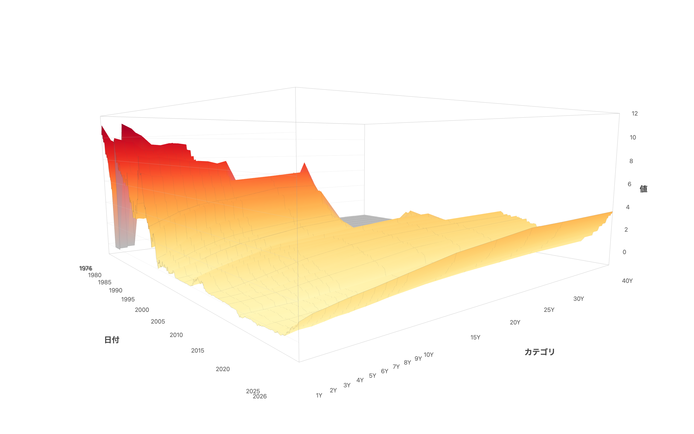
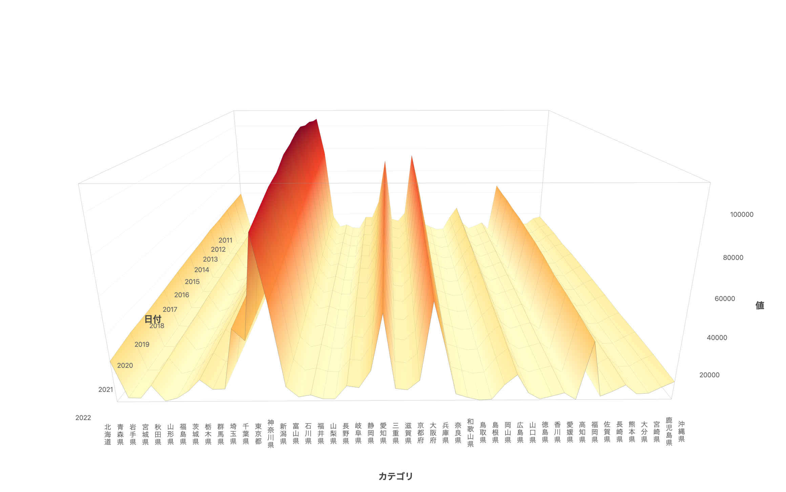





## What is this tool?

A visualization tool that generates interactive 3D surface charts simply by loading CSV data. It lets you view data with a "row × column × value" structure — such as interest rate yield curves and regional statistics — as a three-dimensional landscape. Rotate and zoom freely with your mouse to intuitively grasp overall trends and local variations in your data.



## Features

- **3D surface rendering** — Automatically generates a color-mapped 3D surface from CSV data
- **Camera presets** — Switch between four viewpoints (overview, front, top, side) with one click
- **Color schemes** — Choose from 21 palettes (sequential and diverging). Diverging schemes support a zero-baseline mode
- **Axis labels** — Toggle between horizontal and vertical text. Supports many categories such as Japanese prefecture names
- **CSV import** — Load any CSV via file picker or drag-and-drop
- **Sample data** — Preloaded datasets including Japan Ministry of Finance interest rates (from 1974), U.S. Treasury bonds, and births by prefecture
- **PNG export** — Download high-resolution images with axis labels
- **Share** — Share the current view (data, color scheme, camera position) via URL. OGP images for social media are generated automatically
- **Project save/load** — Save your work to the cloud and restore it anytime

## How to use

- Open the page to see Japan Ministry of Finance interest rate data (last 5 years) displayed by default
- Switch sample datasets from the dropdown, or load your own CSV
- Drag to rotate, scroll to zoom, and right-drag to pan
- Adjust the color scheme and camera position to create the best view
- Click "Export" to download a PNG image, or "Share" to generate a shareable URL
- Shared URLs are viewable by anyone

## Data format

Use a pivot table (cross-tabulation) CSV file. Values are placed at the intersection of rows and columns — the same structure as an Excel pivot table.

```
        col1   col2   col3   ...
row1    5.53   5.47   5.36   ...
row2    5.42   5.38   5.25   ...
```

In CSV format:

```
label,col1,col2,col3,...
row1,5.53,5.47,5.36,...
row2,5.42,5.38,5.25,...
```

- **First column**: Row labels (dates in YYYY-MM-DD format, fiscal years, category names, etc.) — mapped to the depth axis
- **Remaining columns**: Numeric data columns — mapped to the horizontal axis. If column names use duration formats like 1Y or 10M, axis spacing is calculated automatically; otherwise, columns are evenly spaced
- **Cell values**: Numbers — mapped to the height (vertical axis) and color map

Example: Births by prefecture

```
Year,Hokkaido,Aomori,Iwate,...,Okinawa
2011,39292,9532,9310,...,16918
2012,38686,9168,9277,...,17074
```


If your data is in long format, convert it to a pivot table using Excel or Python's `pivot()` before loading.

## References

The idea of using a 3D surface chart for time-series yield curves originated from The New York Times.

A 3-D View of a Chart That Predicts The Economic Future: The Yield Curve - The New York Times https://www.nytimes.com/interactive/2015/03/19/upshot/3d-yield-curve-economic-growth.html
