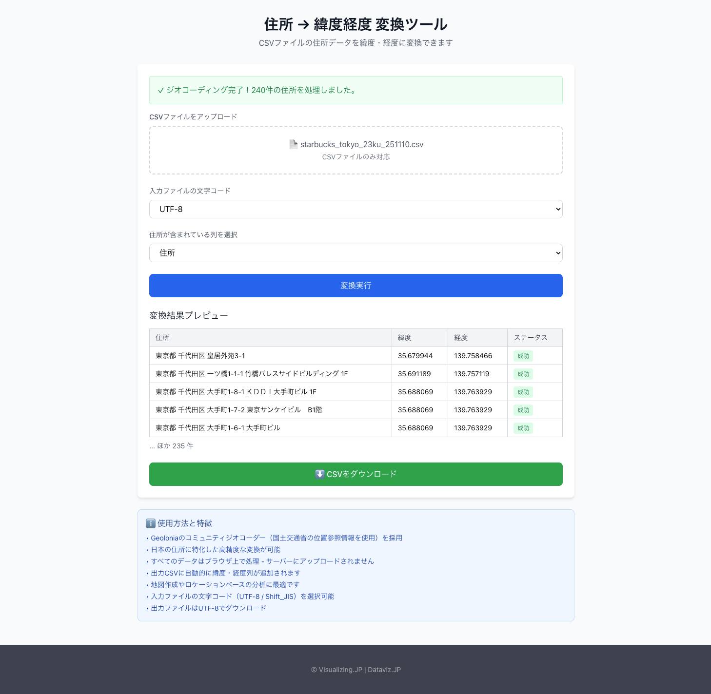




## What is this tool?

A web-based tool that converts Japanese address data into latitude and longitude (coordinates) through geocoding. It can batch-convert multiple addresses into GPS coordinates for use in map creation and location analysis.

## Features

- Batch conversion (CSV support)...Upload a CSV file containing multiple addresses, and retrieve latitude and longitude for each address.
- High-accuracy geocoding...Uses Geolonia's community geocoder (based on the Ministry of Land, Infrastructure, Transport and Tourism's Address Reference Information), achieving conversion accuracy specialized for Japanese addresses.
- Character encoding support...You can specify the character encoding of the input file (UTF-8 / Shift_JIS).
- Browser-only processing...Data is processed entirely within the browser and is never sent to a server (privacy protection).

## How to use

- 1. Upload a CSV file...Load address data by clicking or drag-and-dropping a CSV file.
- 2. Specify the character encoding...Select the appropriate encoding from UTF-8 / Shift_JIS.
- 3. Run the conversion...A CSV file with automatically added latitude and longitude columns is generated.
- 4. Download / Use...Download the output CSV and import it into map rendering or analysis tools.

## Data formats

- Tabular data (CSV)
