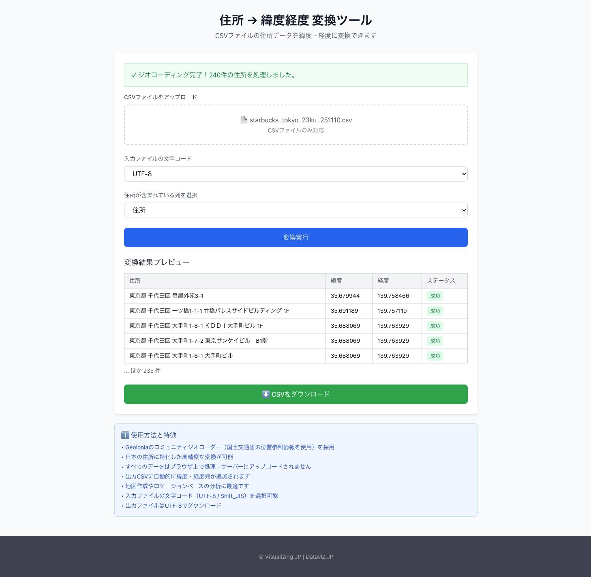




## どんなツールか？

日本の住所データを 緯度・経度（座標）に変換（ジオコーディング）する Web ベースのツールです。複数の住所を一括で GPS 座標に変換し、地図作成や位置分析に活用できます。 

## 機能

- バッチ変換（CSV 対応）...複数の住所を含む CSV ファイルをアップロードして、住所ごとに緯度・経度を取得・変換できます。 
- 高精度ジオコーディング...Geolonia のコミュニティジオコーダー（国土交通省 位置参照情報を利用）を採用しており、日本の住所に特化した変換精度を実現します。 
- 文字コード対応...入力ファイルの文字コード（UTF-8／Shift_JIS）を指定可能。 
- ブラウザ完結処理...データはブラウザ内で処理され、サーバーへ送信されません（プライバシー保護）。 

## 使い方

- 1. CSV ファイルをアップロード...住所データを含む CSV をクリックまたはドラッグ＆ドロップで読み込み。 
- 2. 文字コードを指定...UTF-8／Shift_JIS のうち該当する文字コードを選択。 
- 3. 変換を実行...緯度・経度の列が自動的に追加された CSV を生成。 
- 4. ダウンロード／利用...出力された CSV をダウンロードし、地図描画や分析ツールに取り込み可能。 

## データ形式

- 表データ(CSV)
