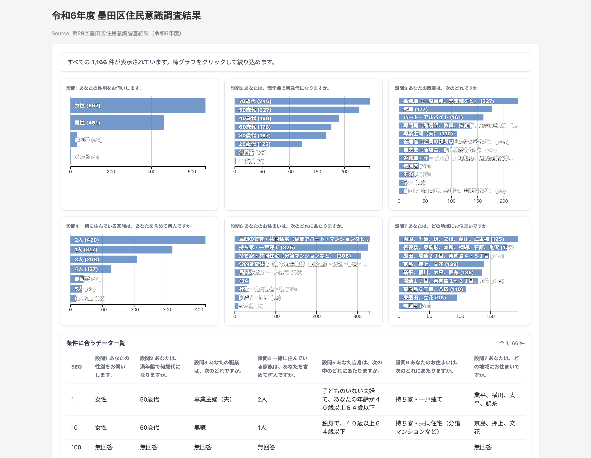




## What is this tool?

Bar Chart Filter lets you upload CSV or TSV data to instantly create an interactive cross-filter dashboard of bar charts. Multiple bar charts are linked together — clicking a bar in one chart filters all other charts and the data table in real time. You can intuitively explore trends and compositions in your data, then share results via URL or export them as images.

[https://bar-chart-filter.dataviz.jp/share.html?id=b399cffd-a05c-4ea8-9e66-278ffac8e5cc](https://bar-chart-filter.dataviz.jp/share.html?id=b399cffd-a05c-4ea8-9e66-278ffac8e5cc)

## Features

- **Cross-filter**: Click a bar to filter all other charts and the table simultaneously
- **Column selection**: Text-type columns are auto-detected and can be displayed as bar charts (up to 6)
- **Data table**: View filtered results in a paginated table
- **Row links**: Specify a URL column to enable clicking table rows to navigate to external pages
- **Style customization**: Customize bar color, row height, and number of table rows displayed
- **Annotations**: Set a title and data source
- **Export**: Download as SVG / PNG / CSV / JSON
- **Sharing**: Generate a shareable URL for anyone to view. Embedding via iframe is also supported
- **Project save & load**: Save your work and resume later

## How to use

1. Drag & drop or click to upload a CSV / TSV / JSON file
2. Text-type columns are auto-detected and listed as bar chart candidates in the Style tab
3. Click the chips of the columns you want to display (up to 6)
4. Click any bar in a chart to filter the other charts and the data table
5. Enter a title and data source in the Annotations tab
6. Export as SVG/PNG/CSV/JSON from the Share tab, or click the Share button to generate a shareable URL

## Data format

Supports CSV / TSV / JSON (array format).

- **CSV**: Comma-separated. First row is the header
- **TSV**: Tab-separated. First row is the header
- **JSON**: Array of objects `[{"col1":"val1", ...}, ...]` or `{"data": [...]}` format

No specific column names are required. Any column structure can be loaded. Columns containing text values are automatically listed as bar chart candidates.
