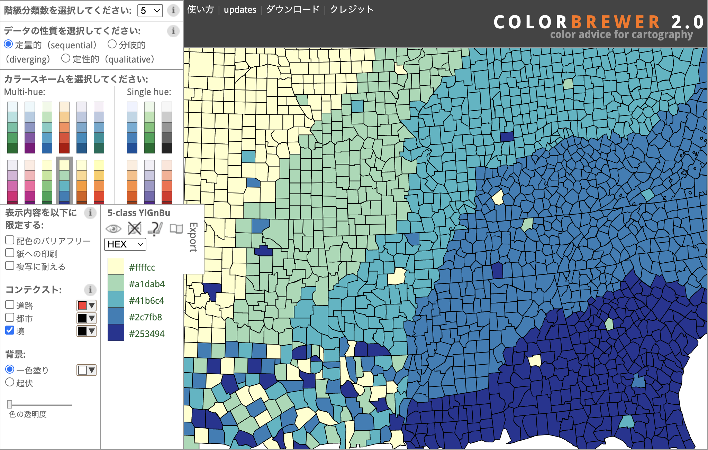
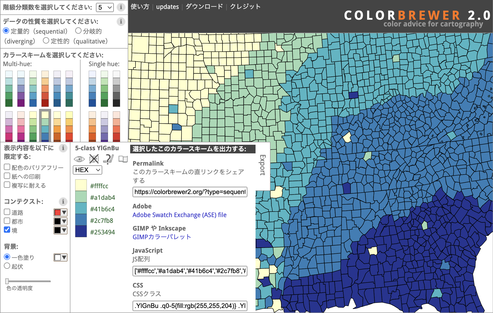




## What is this tool?

ColorBrewer is an online tool for selecting optimal color palettes for data visualization and maps. Its purpose is to suggest color schemes suited to color visibility and the nature of categorical or numerical data.

## Features

- Color scheme selection assistance...Presents color schemes for sequential data, diverging data, qualitative data, and more based on data characteristics.
- Usage considerations...Filter options for colorblind safety, print friendliness, and photocopy safety.
- Number of classes...Adjust the number of colors (e.g., 3 to 12) to select the optimal palette.
- Color output formats...Export selected palettes in HEX/RGB/CMYK formats, CSS, JavaScript arrays, and more.
- Save and load created projects.

## How to use

- 1. Select data nature...Choose from sequential (ordered), diverging (bipolar around a center value), or categorical (unordered).
- 2. Specify number of colors (classes)...Select the desired number of data classes (e.g., 3, 4, ...).
- 3. Review and adjust the palette...Check how the selected palette looks on maps or charts.
- 4. Export...Export as CSS, JavaScript, Adobe Swatch, etc. as needed.

