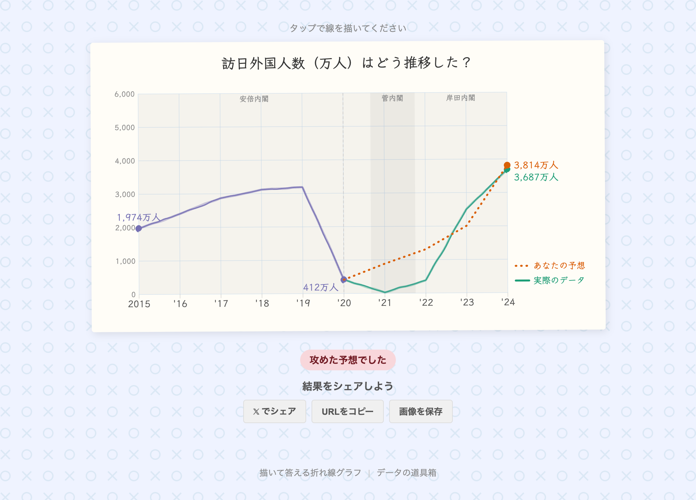





## どんなツールか？

「描いて答える折れ線グラフ」は、時系列データをもとに"予想して描く"インタラクティブなクイズを作成できるツールです。出題者がデータをアップロードし、回答者は途中から先のトレンドを指でなぞって予想します。答え合わせでは実際のデータと比較され、予想の精度がスコアで表示されます。



## 機能

- **CSVアップロード**: 手持ちの時系列データからクイズを作成
- **サンプルデータ**: 米国失業率、日本の人口、訪日外国人数、円ドル為替レートをすぐに試せる
- **対象期間の選択**: データの一部を切り出して出題範囲を設定
- **期間アノテーション**: 政権交代や経済イベントなどの背景情報をチャートに重ねて表示
- **手書き風スタイル**: 標準スタイルに加え、手書き風の描画スタイルを選択可能
- **公開・共有**: 作成したクイズをURLで共有、SNSでシェア
- **プロジェクト保存・読込**: 作成途中のクイズを保存して後から編集

## 使い方

1. **データをアップロード** — CSVファイルをドラッグ＆ドロップ、またはサンプルデータを選択
2. **対象期間を設定** — データの開始・終了の範囲を指定
3. **クイズを設定** — タイトル（質問文）、出題開始ポイント、単位、スタイルを入力
4. **アノテーションを追加（任意）** — 期間ごとのラベルを設定して背景に表示
5. **プレビューで確認** — 右パネルでリアルタイムにチャートを確認
6. **公開** — URLを発行して回答者に共有

## データ形式

1行目をヘッダーとするCSVファイルに対応しています。

| 列 | 内容 | 例 |
|---|---|---|
| X軸（時系列） | 年または年月 | `2000`, `2020/04` |
| Y軸（数値） | 任意の数値 | `4.9`, `12615`, `105.21` |

```csv
date,value
2000,4.0
2001,4.7
2002,5.8
```

- X軸は YYYY（年）または YYYY/MM（年月）形式に対応
- 複数列のCSVの場合、アップロード後にX軸・Y軸の列を選択できます
- JSON形式（[{"x": 2000, "y": 4.0}, ...]）にも対応