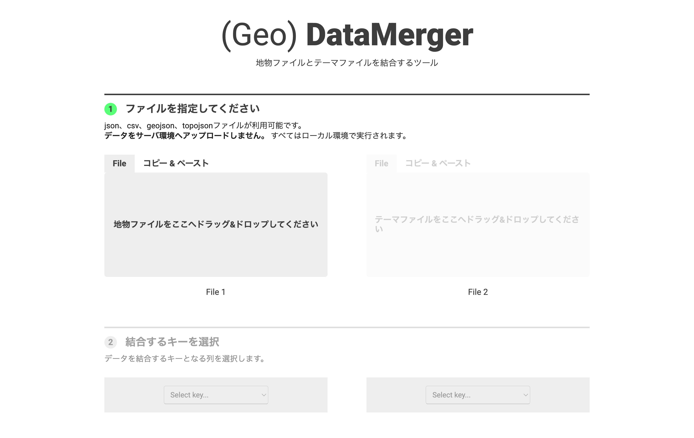




## What is this tool?

A web-based tool for easily merging geographic data (GeoJSON/TopoJSON) with attribute data (CSV/JSON). It is a convenient data processing tool for when you want to link thematic data (e.g., population, attribute values) to map data.

## Features

- Load geographic and attribute data...Read GeoJSON/TopoJSON, CSV, and JSON files, and preview their contents.
- Key-based join...Join geographic data (Feature properties) with attribute data using a common key column (left join basis).
- Remove unnecessary columns...After merging, select and remove unwanted columns from the output via the UI.
- Output format selection...Save and download the merged data as GeoJSON/TopoJSON/CSV.

## How to use

- 1. Load geographic and attribute data...Load GeoJSON/TopoJSON on the left side and CSV/JSON on the right side.
- 2. Specify the join key...Select the column (key) used for joining from each data preview, and verify that they match correctly.
- 3. Remove unnecessary columns...Select and delete unneeded attribute columns after merging.
- 4. Export and save...Export the merged data as GeoJSON/TopoJSON/CSV.

## Data formats

- Input formats
    - GeoJSON: Geographic Features (points/lines/polygons) + attributes.
    - TopoJSON: A geographic data format that preserves topology (an extension of GeoJSON).
    - CSV/JSON: Thematic data to merge (tabular data containing region codes or key-value pairs).
- Output formats
    - GeoJSON/TopoJSON: Merged geospatial data.
    - CSV: Merged tabular data.

