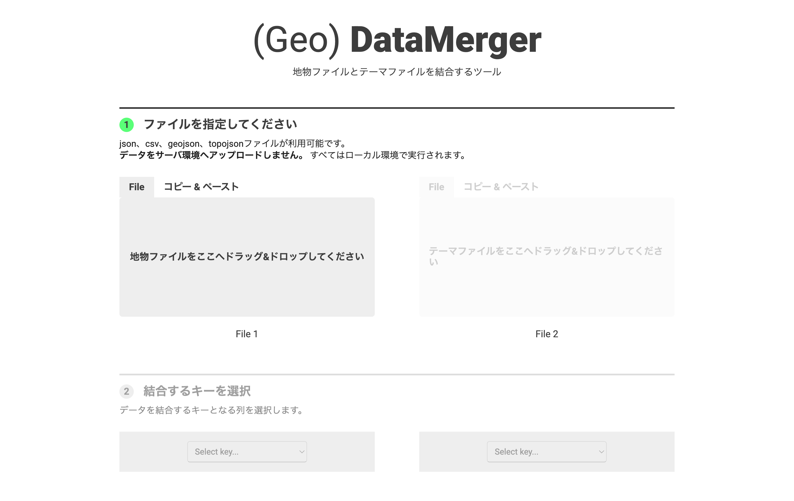




## どんなツールか？

地理データ（GeoJSON／TopoJSON）と属性データ（CSV／JSON）を簡単に結合できる Web ベースのツールです。地図データにテーマデータ（例：人口、属性値など）を結びつけたいときに便利なデータ加工支援ツールです。 

## 機能

- 地理データと属性データの読み込み...GeoJSON／TopoJSON、CSV、JSON ファイルを読み込み、内容をプレビュー。 
- キーによる結合（Join）...地理データ（各 Feature の properties）と属性データを共通のキー列で結合（左結合ベース）。 
- 不要列の削除...結合後、出力に含めたくない列を UI 上から選択して除去可能。 
- 出力形式の選択...結合後のデータを GeoJSON／TopoJSON／CSV などで保存・ダウンロード。

## 使い方

- 1. 地理データと属性データを読み込み...左側に GeoJSON／TopoJSON、右側に CSV／JSON を読み込ませます。 
- 2. 結合キーを指定...各データのプレビューから結合に使う列（キー）を選択し、正しく一致しているか確認。 
- 3. 不要列を除去...マージ後に不要な属性列を選んで削除します。 
- 4. 出力・保存...結合したデータを GeoJSON／TopoJSON／CSV でエクスポート。

## データ形式

- 入力形式
    - GeoJSON：地理 Feature（点／線／多角形）＋属性。 
    - TopoJSON：トポロジーを保つ地理データ形式（GeoJSON の拡張）。 
    - CSV／JSON：結合するテーマデータ（地域コードやキーと値を持つ表形式）。 
- 出力形式
    - GeoJSON／TopoJSON：結合された地理空間データ。 
    - CSV：結合後の表形式データ。 

