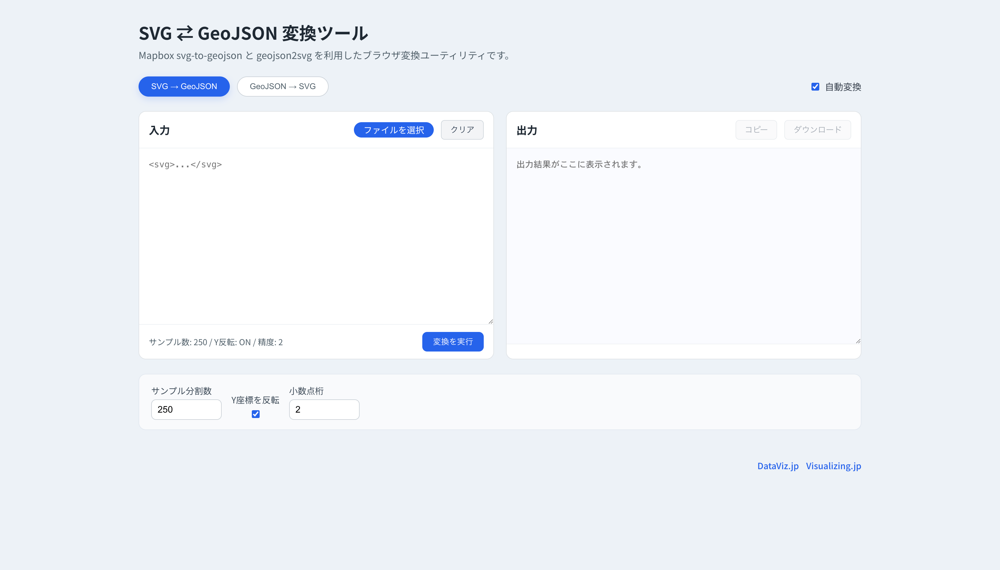




## What is this tool?

A web-based tool that assists with converting and visualizing between geospatial data (GeoJSON) and SVG (vector image format).

It is designed to convert geographic information such as map data and polygons into the SVG format, which is convenient for web display and print use, or to help work with SVG as GeoJSON format.

GeoJSON is a standard JSON-based format for location data, widely used for web mapping and GIS integration.

## Features

Bi-directional conversion between geospatial data (GeoJSON) and SVG (vector image format)

## How to use

- 1. Load a file
- 2. Download

No special operations are required.

## Data formats

- SVG
- GeoJSON

