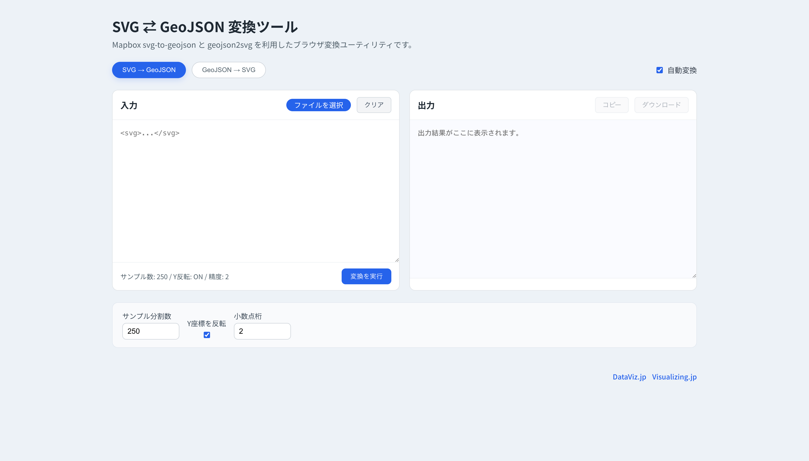




## どんなツールか？

地理空間データ（GeoJSON）と SVG（ベクター画像形式）との相互変換／可視化を支援する Web ベースのツールです。

地図データやポリゴンなどの地理情報を、Web 表示や印刷用途に使いやすい SVG 形式に変換したり、逆に SVG を GeoJSON 形式として扱う際の補助を目的とします。

GeoJSON は位置情報を持つ JSON 形式の標準フォーマットで、Web マッピングや GIS との連携に広く使われます。

## 機能

地理空間データ（GeoJSON）と SVG（ベクター画像形式）との相互変換

## 使い方

- 1. ファイルの読み込み
- 2. ダウンロード

特別な操作は不要です。

## データ形式

- SVG
- GeoJSON

