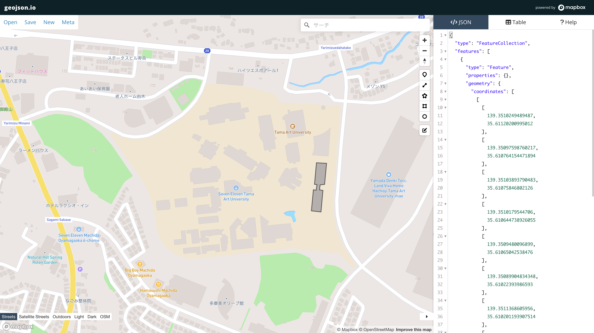




## What is this tool?

A simple browser-based tool for creating, viewing, and sharing spatial data (such as GeoJSON). You can draw and edit geographic data on a map, and the corresponding GeoJSON is generated instantly, making it ideal for prototyping and verifying spatial data.

## Features

- Draw and edit data on a map...Draw markers (points), polylines (lines), and polygons (areas) on the map and freely edit them.
- Real-time code editing and preview...Drawn shapes are instantly updated and displayed as GeoJSON code, and attribute editing is also supported.
- Multi-format import...Import and edit spatial data including GeoJSON, TopoJSON, CSV, KML, and more (historically supported by the tool).
- Simple attribute editing...Edit and delete field values in table view to adjust Feature properties.

## How to use

1. Load data or create new drawings...Upload existing GeoJSON, or draw points, lines, and polygons on the map.
2. Edit attributes and code...Interactively edit drawings and attribute information.
3. Save and share...Download the completed GeoJSON as a file or share via URL parameters.

## Data formats

- Input formats
	-	GeoJSON: A JSON format centered on geographic Features (points, lines, areas).
	-	TopoJSON / CSV / KML / GPX, etc.: Multiple geographic data formats can be loaded and converted to GeoJSON for editing.
- Output formats
    - GeoJSON, TopoJSON, CSV, KML, WKT, Shapefile

