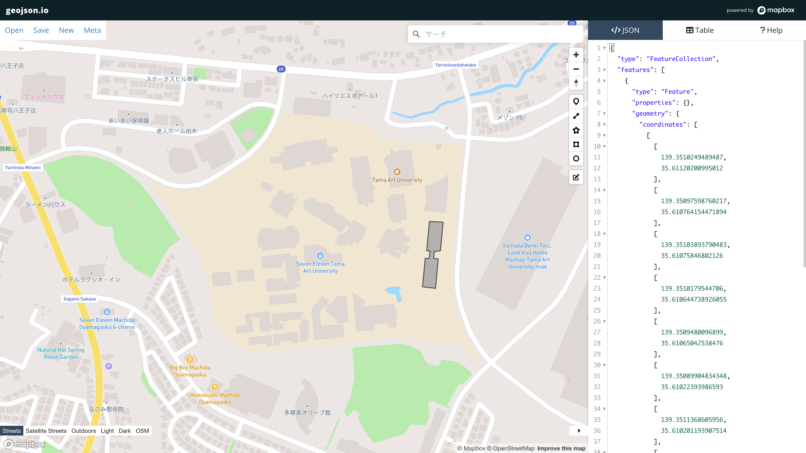




## どんなツールか？

ブラウザで動作するシンプルな空間データ（GeoJSON など）の作成・閲覧・共有ツールです。地図上で地理データを描画・編集しながら、対応する GeoJSON が即座に生成されるため、空間データのプロトタイピングや確認に最適です。

## 機能

- 地図上でデータの描画・編集...マーカー（点）、ポリライン（線）、ポリゴン（面）を地図上で描画し、自由に編集可能。 
- リアルタイムコード編集・プレビュー...描いた形状が GeoJSON 形式のコードとして即時に更新・表示され、属性編集も可能。 
- 複数形式の読み込み...GeoJSON をはじめ、TopoJSON、CSV や KML などの空間データを読み込んで編集できます（ツールとして歴史的にサポート）。 
- 簡易的な属性編集...テーブルビューでフィールド値の編集や削除が行え、空間 Feature のプロパティを調整可能。 

## 使い方

1. データを読み込む／新規描画...既存の GeoJSON 等をアップロードするか、地図上で点・線・多角形を描きます。 
2. 属性やコードを編集...描画や属性情報をインタラクティブに編集します。 
3. 保存・共有...完成した GeoJSON をファイルとしてダウンロードしたり、URL パラメータで共有できます。 

## データ形式

- 入力形式
	•	GeoJSON：地理空間 Feature（点・線・面）を中心とした JSON 形式。 
	•	TopoJSON / CSV / KML / GPX など：複数の地理データ形式を読み込み、GeoJSON に変換して扱うことができます。 
- 出力形式
    - GeoJSON、TopoJSON、CSV、KML、WKT、Shapefile

