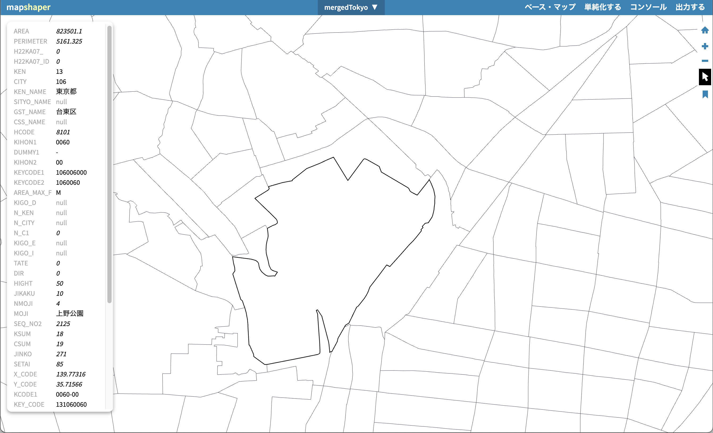
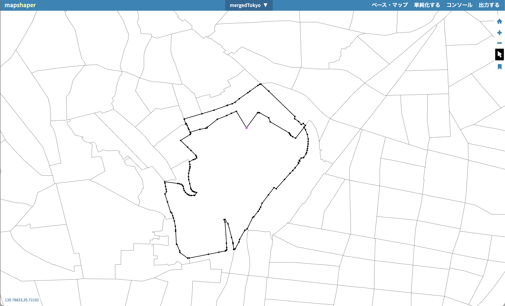
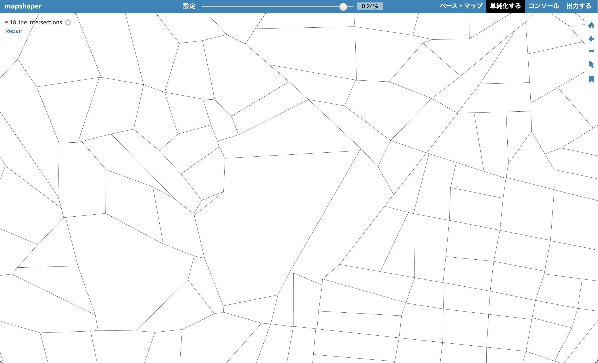




## What is this tool?

A web-based tool for editing, converting, and simplifying geospatial vector data (GIS). It loads map data and lets you intuitively perform operations such as shape simplification, attribute editing, and format conversion. Its key advantage is the ability to process data in the browser without relying on desktop GIS software.

## Features

- Load and display geographic data: Import and display vector data such as Shapefile, GeoJSON, and TopoJSON.
- Shape simplification: Reduce polygon/line vertices to shrink file size while preserving topology.
- Attribute data editing: Modify and join attribute table contents, or delete unnecessary fields.
- Conversion and export: Convert and export to multiple formats (Shapefile, GeoJSON, TopoJSON, CSV, TSV, SVG, etc.).
- Clipping and dissolving: GIS processing such as clipping, merging, splitting, and dropping data.

---

## How to use

- 1. Load and display data...Imported geographic data is displayed in map view, where you can review attributes and shapes.
- 2. Edit and process
    - Simplification: Run tools for vertex reduction and topology preservation.
    - Attribute editing: Add, delete, or join fields.
    - Merge and clip: Merge multiple datasets or clip to a specified area.
- 3. Export...Save and download in the desired format from the Export menu.

## Data formats

- Mapshaper handles the following major GIS vector data formats for input and output:
- Shapefile (ESRI's standard GIS format; a set of .shp/.dbf/.shx files, etc.)
- GeoJSON (JSON-based geographic information format)
- TopoJSON (topology-compressed format based on GeoJSON)
- CSV / TSV (as tabular data containing coordinates and attributes)
- SVG (as vector image output for geographic shapes)

