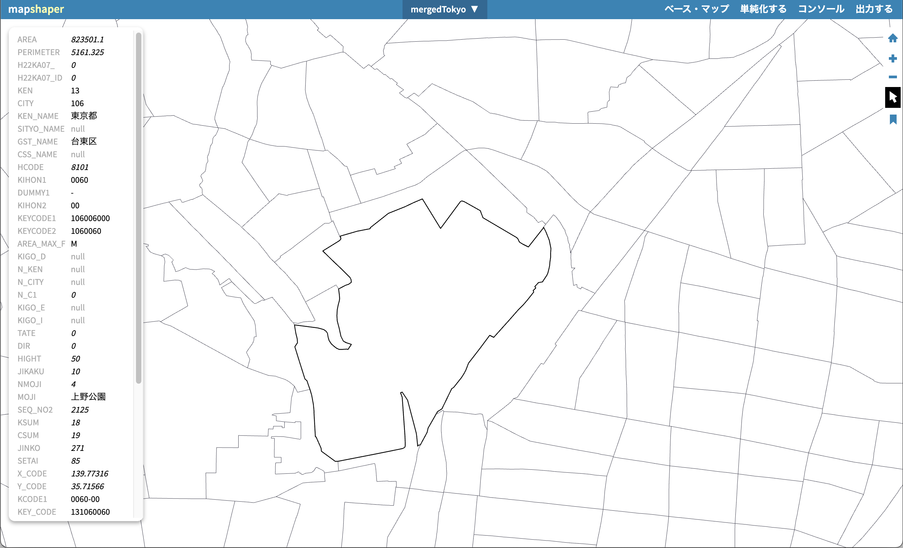
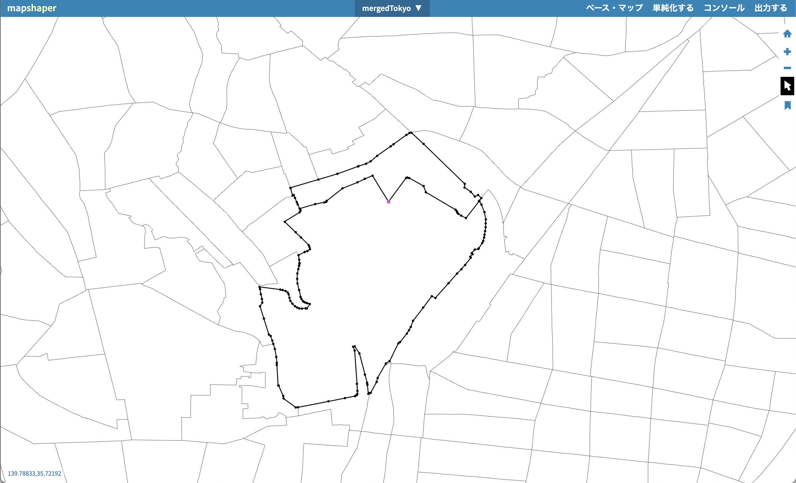
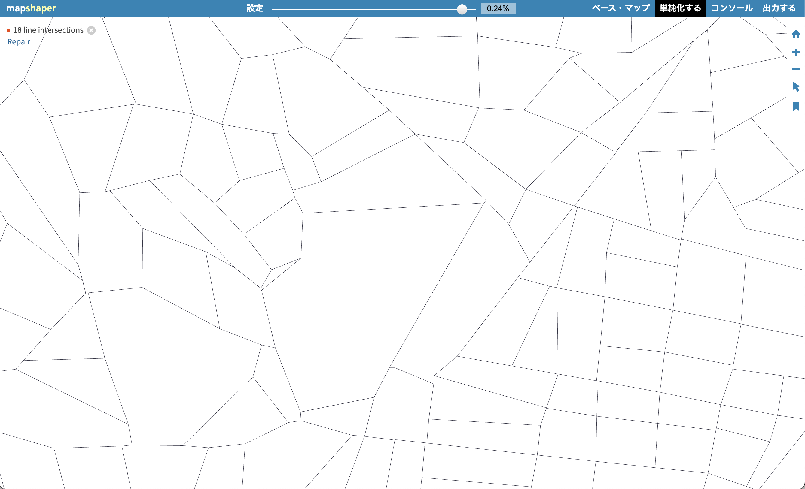

Mapshaperは地図データ用のエディタです。ブラウザだけで手軽に地図ファイルの簡素化や、別ファイル形式への変換が行なえます。

## 主な機能

1. **トポロジを保ったシンプリファイ**：Visvalingam-Whyatt アルゴリズム等で形状を簡素化しつつ位相を維持します。
2. **属性操作**：列の削除・フィールド追加・`group` による集計などをコマンドライン／GUI から実行可能。
3. **形式変換**：Shapefile・GeoJSON・TopoJSON・CSV（ポイント）など多様な形式に対応。
4. **ジオメトリ修正**：`dissolve`、`erase`, `clip`, `split` などの空間演算をブラウザ上で完結。

## 推奨ワークフロー

1. 左上の `Import` からデータを読み込み、ガイド付きツアー（`?` ボタン）で基本操作を確認します。
2. `Simplify` でプレビューを確認しながらトポロジ保持の比率を設定し、スライダーで適切な値を探ります。
3. `Console` を開き、`-filter-fields`, `-each`, `-dissolve` など CLI コマンドと同様のスクリプトを実行して属性・形状を加工します。
4. `Export` で用途に合わせた形式を選び、CRS（座標系）を指定したい場合は `-proj` コマンドも併用します。

