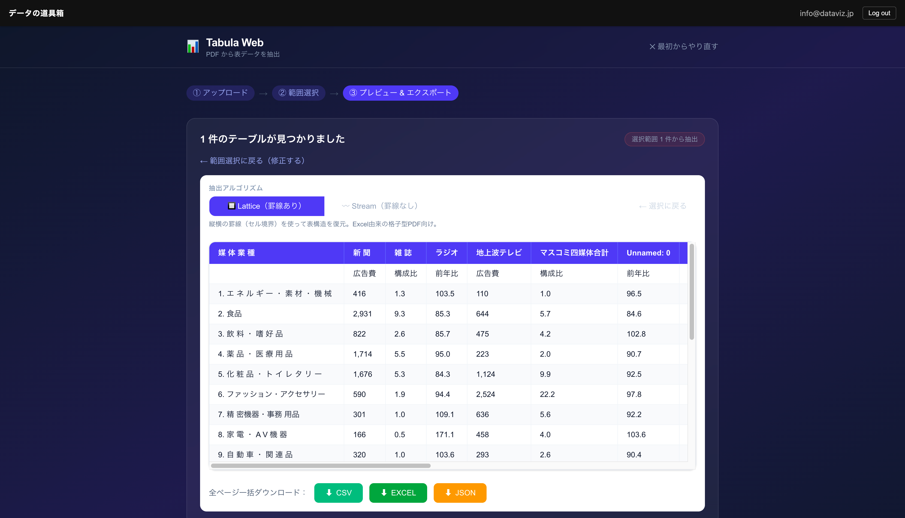
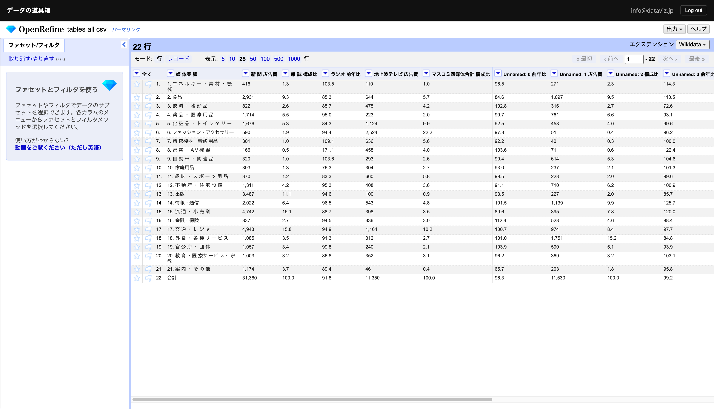
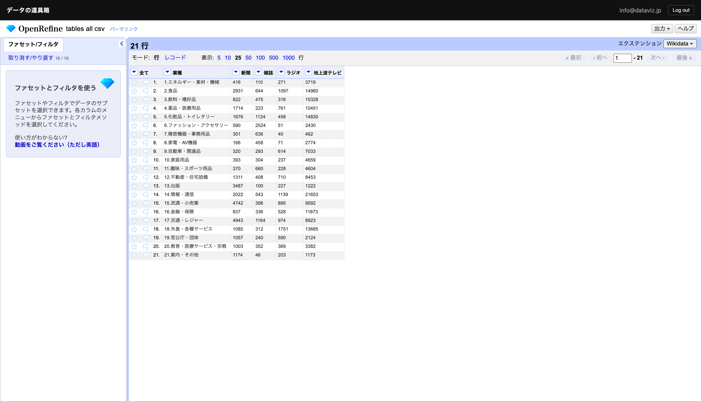
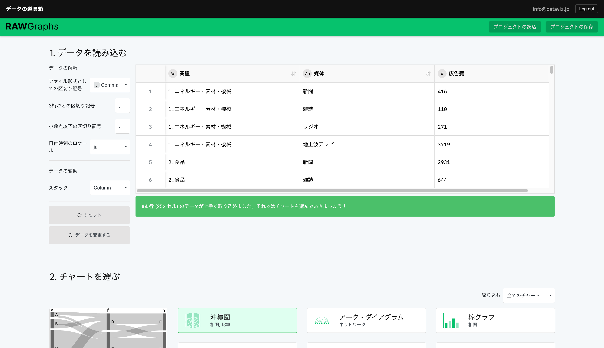
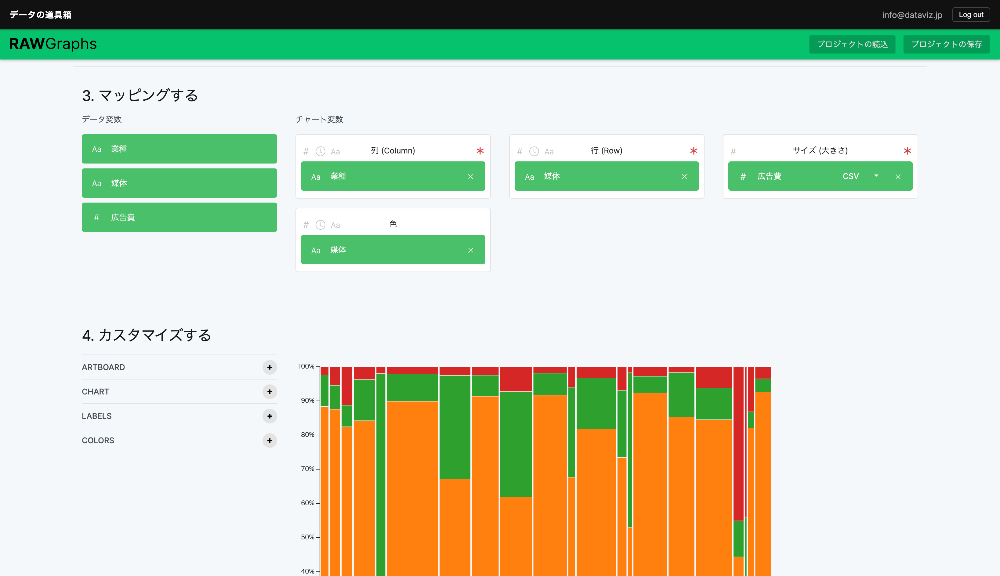
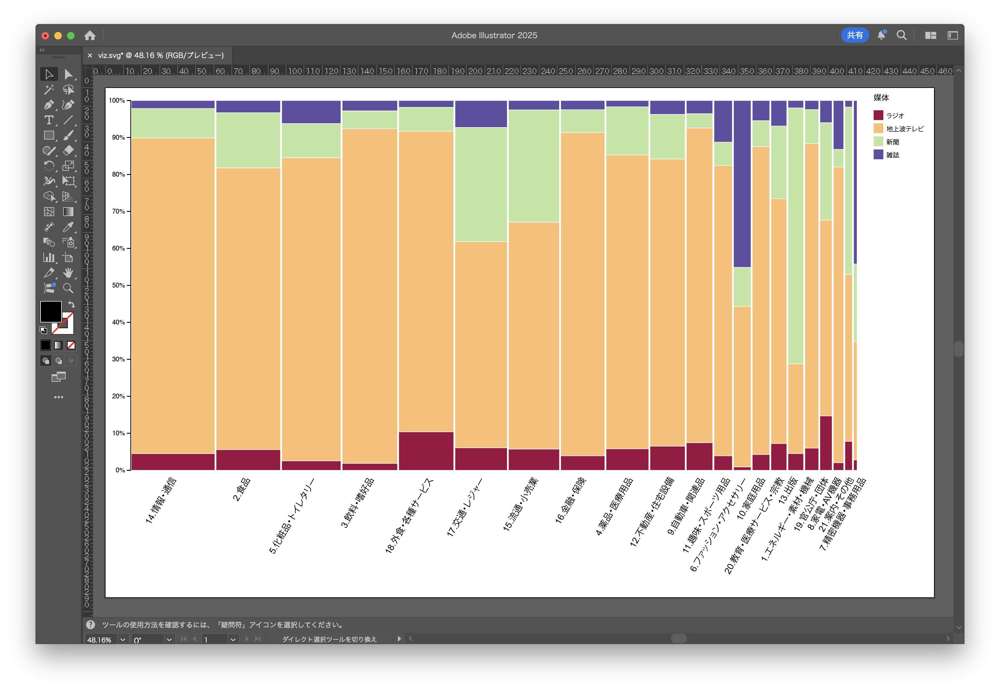

Every year, Dentsu publishes "Advertising Expenditures in Japan." We visualized the advertising expenditure by industry across four traditional media (excluding the internet).

Normally, using bar charts or pie charts would require creating as many charts as there are industries (21) or media types (4). With a Mekko chart, however, you can represent both dimensions as vertical and horizontal proportions within a single chart.

Here we introduce how to create one using the tools provided by this service.




Paid users can open the link above as an editable project file to learn how it was made and examine the data structure.

The data is sourced from Dentsu's PDF report.

- [2025 Advertising Expenditures in Japan - Dentsu](https://www.dentsu.co.jp/news/release/2026/0305-011003.html)

## Extracting Table Data from a PDF

The published materials are available as a PDF. As-is, this data cannot be processed by a computer. Manual data entry would be tedious.

In cases like this, Tabula makes it easy to extract table data from PDFs.




## Cleansing the Data

To transform the data into a tidy format that computers can process, OpenRefine is very useful. It allows you to cleanse data with visual confirmation.

We removed unnecessary columns, as well as unnecessary spaces and commas.

The data is still in a cross-tabulation (matrix) format, so we need to perform the reverse of a pivot table in Excel. OpenRefine lets you do this visually as well.

Data cleansing is now complete.
Choose your favorite visualization tool.
In this case, we'll use RawGraphs, which makes it easy to create Mekko charts.

### Visualizing Data with RawGraphs

RawGraphs is a single-page tool where each step appears as you scroll down.

### Completed

Export as PNG to include in slides or publish on the web.

Export as SVG to edit in design tools such as PowerPoint, Adobe Illustrator, or Figma.
Some axis labels were too close together, so we adjusted them.

#### Editing in PowerPoint

#### Editing in Adobe Illustrator

