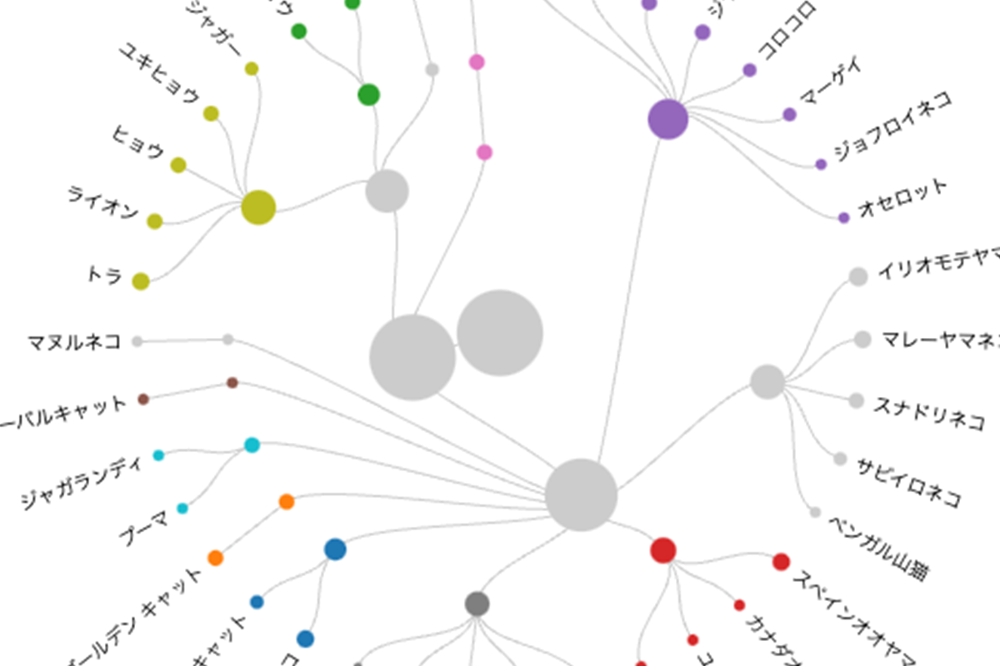
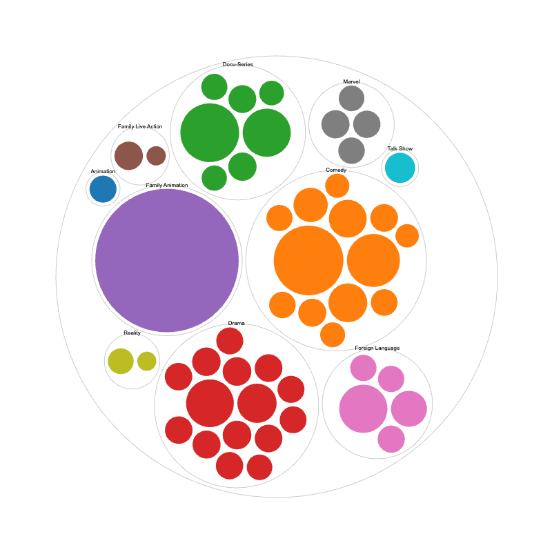




## What is this tool?

A tool that lets you create a wide variety of charts with an intuitive interface.
While it is not designed for fine-tuning charts on its own, it excels as a drafting tool for exporting in SVG format and refining in graphic tools (such as Figma or Adobe Illustrator) or PowerPoint.

A missing link tool that bridges the gap between Excel and graphic applications like Adobe Illustrator.

## Features

- 32 diverse chart templates across 8 categories
- Export as PNG, JPEG, or SVG images
- Style adjustments
- No interactive content creation capabilities
- Save and load created projects

## How to use

- 1. Load your data
- 2. Choose a chart
- 3. Map the data
- 4. Customize

## Data formats

- Tabular data (CSV, TSV, DSV)
- JSON

## Note

Drag operations may not work properly when using Microsoft Edge.
In that case, please use another browser such as Chrome.

