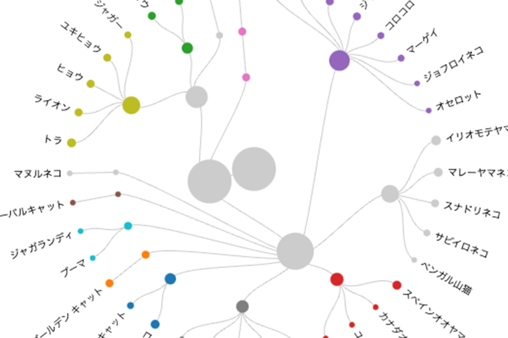
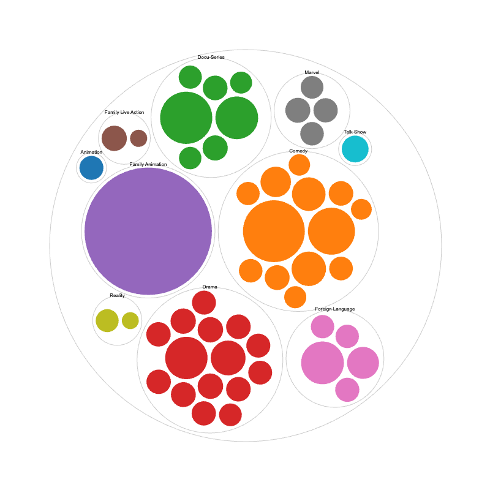




ExcelとAdobe Illustratorなどのグラフィック・アプリの間をつなぐミッシング・リンクとなるツール。

多様なチャートの種類を、手軽に作成することができます。出力は画像かSVG形式です。

ログイン不要ですが、作業をサーバ側で保存することはできません。

## 主な機能

1. **ドラッグ＆ドロップのマッピング**：列を視覚変数（位置・サイズ・色など）に割り当てることでチャート仕様を組み立てます。
2. **カスタムチャート**：ネットワーク図・Treemap・Sunburst・Voronoi など、約 30 種類のチャートを公式ギャラリーから選択可能。
3. **データ変換**：グルーピング、集計、フィルターなどを UI 上で簡単に適用できます。
4. **エクスポート**：SVG・PNG のほか、`Export data` で変換後データを CSV/JSON へ出力し、他ツールへの橋渡しに利用できます。

## ワークフローのヒント

1. `1. データを読み込む` で CSV / TSV / JSON / Google Sheets からデータを読み込み、プレビューで型を確認します。
2. `2. チャートを選ぶ` でチャートを選択します。
3. `3. マッピングする` にて、左側のフィールドリストからエンコーディングへドラッグし、必要であれば詳細設定を調整します。
4. `4. カスタマイズする` ではカラーや凡例、フォントなどのスタイル調整が可能。
5. `5. 書き出す` 作業後にさまざまな形式で保存できます。SVG を保存し、Illustrator や Figma 等で仕上げることができます。RawGraphs自体にはデータや作業の保存機能はなく `.rawgraphs` 形式で保存しておくと、後日作業の続きを再開できます。
