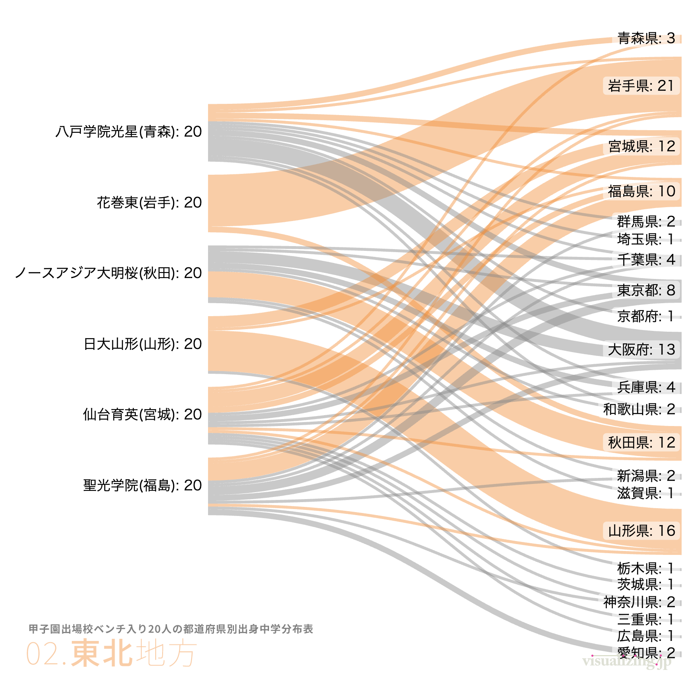
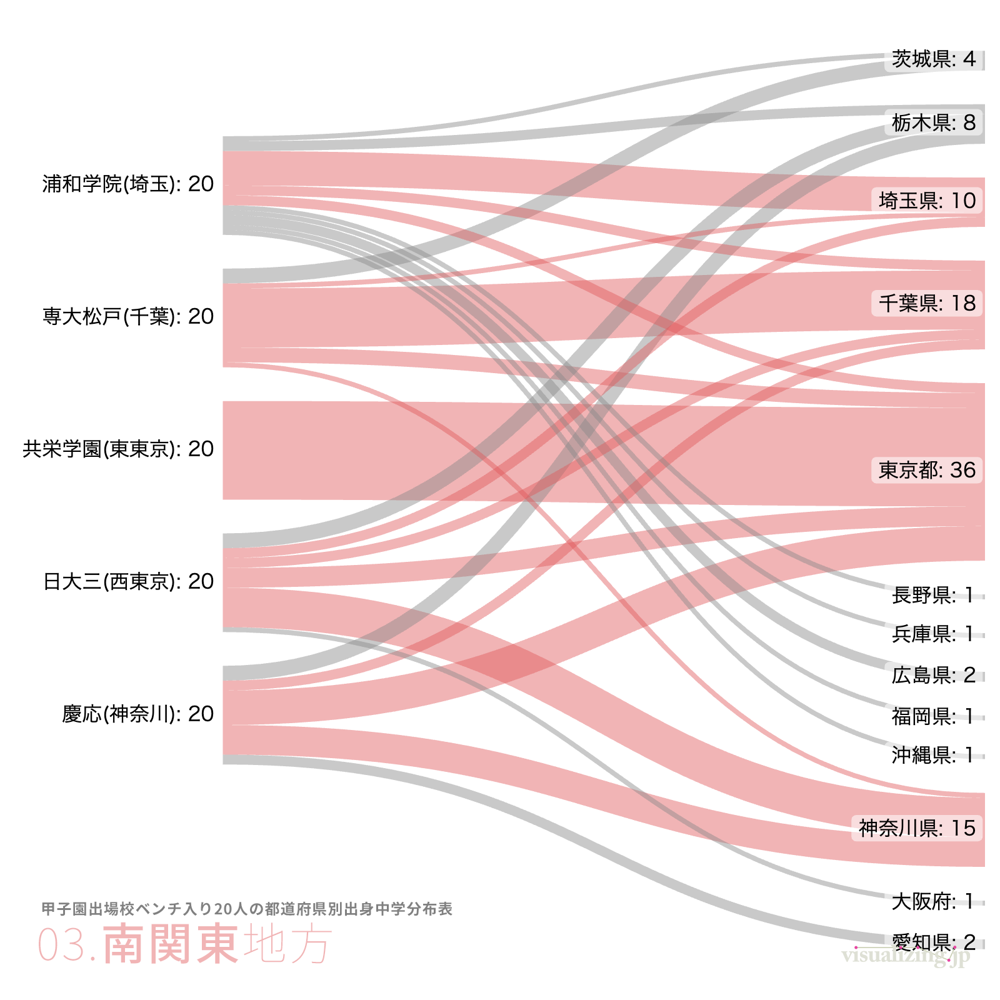




## What is this tool?

A tool specialized for creating Sankey diagrams. Because the data format is simple, anyone can easily create Sankey diagrams using data prepared in spreadsheet tools.

## Features

- Create beautiful Sankey diagrams
- Export as PNG or SVG images

## How to use

- Load data from the "Input" section
- Adjust styles
- Export the result

## Data formats

- Proprietary notation for this tool
- source [value] target

