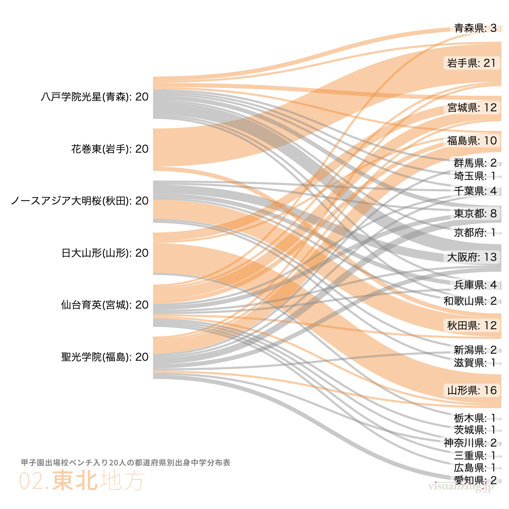
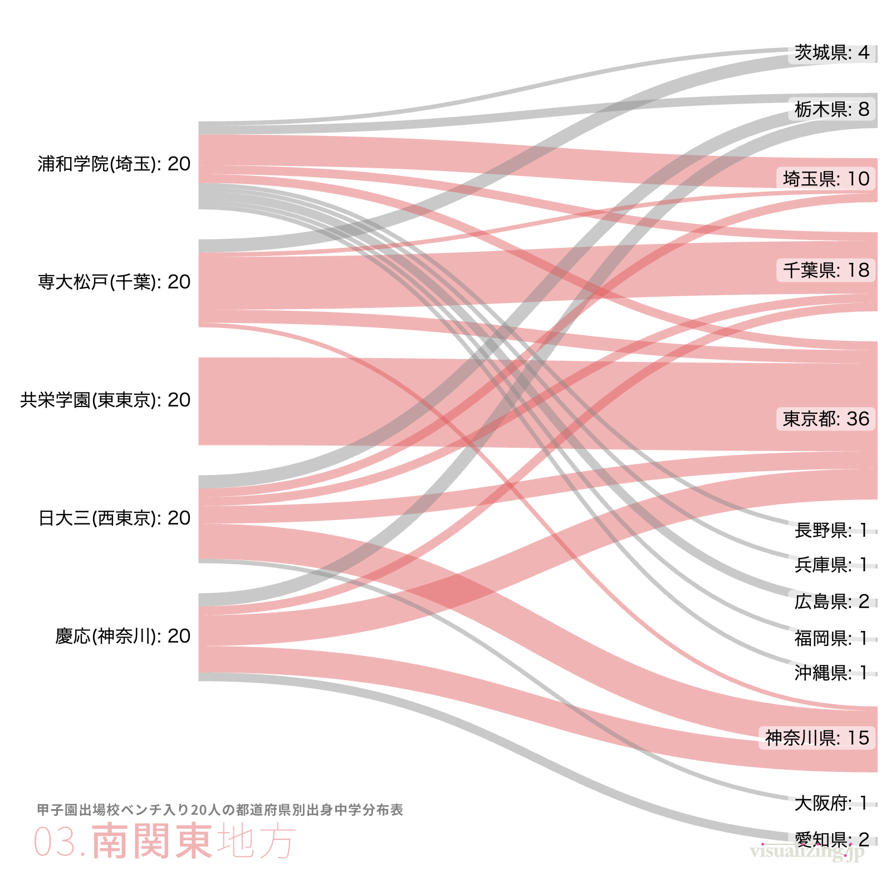




サンキー・ダイアグラムの作成に特化したツールです。データ形式が簡易なものなので、スプレッドシート・ツールで作成したデータを用いて、誰でも手軽にサンキー・ダイアグラムの作成が出来ます。出力はPNGかSVG形式です。

## 主な機能

1. **入力フォーマット**：`A [value] B` のようなテキスト記法、または v2 では CSV 形式をアップロードしてフローを定義。
2. **スタイル調整**：ノードの色・順序・幅、リンクのカーブ、ラベル位置などを細かく設定できます。
3. **エクスポート**：PNG・SVG・JSON での書き出しに対応。SVG はベクター編集ソフトで再調整可能です。
4. **テンプレート**：公式サイトの `Gallery` や `Manual` で、入力例とスクリーンショットが共有されています。

## 使い方の流れ

1. 左側の `Flows` にテキストでデータを記述し、`Preview` を押すとリアルタイムでチャートが再描画されます。
2. `Nodes` タブでノードごとに色やラベルを設定し、`Layout` でノード順序やスペーシングを調整します。
3. 出来上がった図は `Export` から SVG/PNG を保存し、報告資料や Web ページで利用できます。

