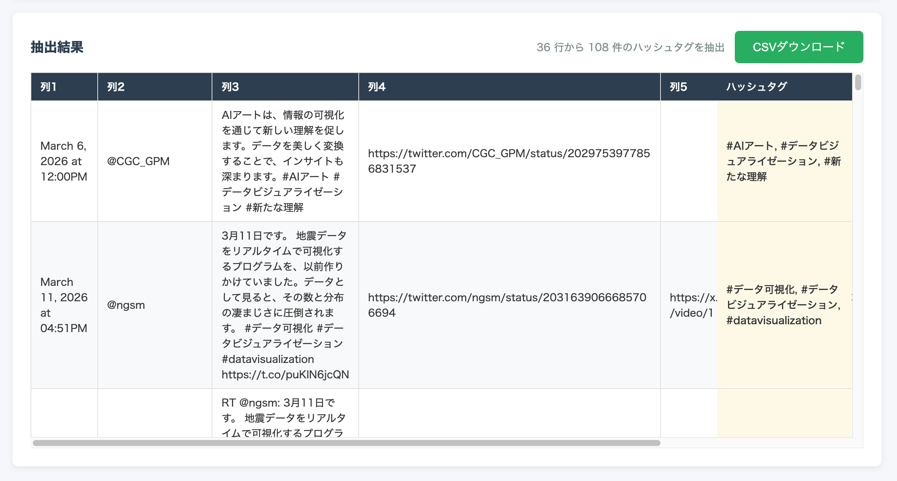




## どんなツールか？

CSV/TSVなどの表データから、テキストに含まれるハッシュタグ・メンション・URL・メールアドレス・電話番号を正規表現で一括抽出するブラウザツールです。データはすべてブラウザ上で処理され、サーバーには送信されません。

## 機能

- **5種類のエンティティ抽出**: ハッシュタグ（#）、メンション（@）、URL、メールアドレス、電話番号
- **CSV/TSV対応**: ファイルアップロードまたはテキスト貼り付けでデータを読み込み
- **列選択**: 抽出対象の列をサンプル値付きで選択可能
- **プレビュー機能**: 読み込んだデータを抽出前に確認
- **CSV出力**: 抽出結果を元データに列追加した形でCSVダウンロード（BOM付きUTF-8）
- **日本語/英語対応**: ブラウザの言語設定に応じて自動切替、手動切替も可能

## 使い方

1. **データ入力** — CSVファイルをドラッグ&ドロップ、またはテキストエリアにCSV/TSVデータを貼り付け
2. **プレビュー** — 読み込んだデータの列数・行数を確認（先頭100行を表示）
3. **抽出設定・実行** — 対象列と抽出タイプ（ハッシュタグ/メンション/URL/メール/電話番号）を選んで「抽出を実行」
4. **結果確認・ダウンロード** — 抽出件数を確認し、「CSVダウンロード」で結果を保存
 

## データ形式

- **入力**: CSV（カンマ区切り）、TSV（タブ区切り）、TXT
- **ヘッダー**: 1行目を列名として扱うかどうかを選択可能（ヘッダーなしの場合は「列1, 列2, ...」と自動命名）
- **出力**: 元データの全列 ＋ 抽出結果列を追加したCSV（BOM付きUTF-8）。1セルに複数のエンティティがある場合はカンマ区切りで結合

