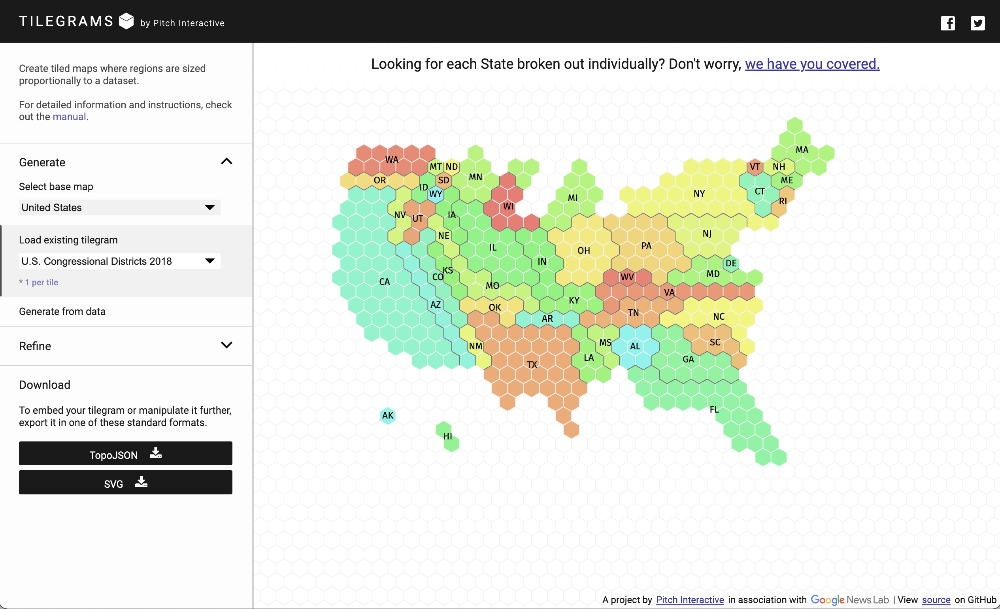
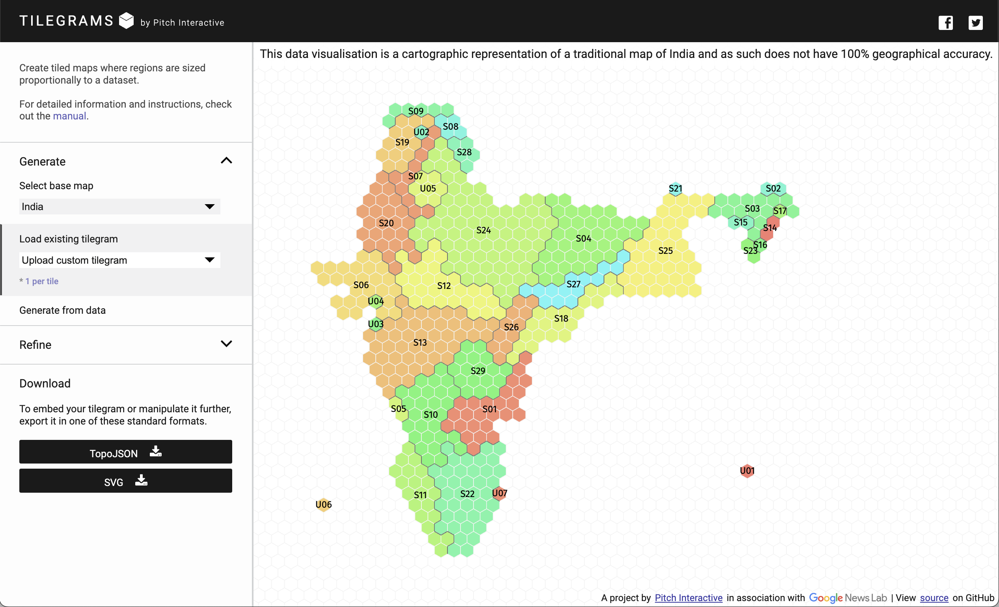
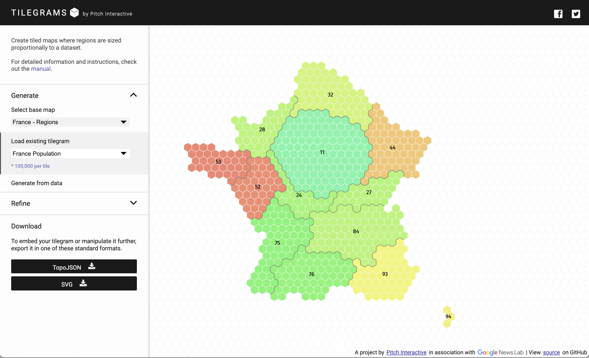




## What is this tool?

A web-based map creation tool that generates "tilegrams (tiled cartograms)" -- representations of geographic regions using hexagonal tiles, with region sizes visually adjusted according to data values. Region areas are expressed proportionally to population or other indicators through the number of tiles, while maintaining an approximate resemblance to the original geographic shape.

## Features

- Hexagonal tile cartogram generation...Represents geographic areas as uniform hexagonal tiles, varying the number of tiles per region according to data values.
- Built-in maps and custom data support...In addition to standard map templates for the United States, Europe, and other regions, you can load custom data to generate tilegrams.
- Interactive adjustment...Drag tiles to adjust placement, or change the resolution (the value each tile represents) to optimize the appearance.
- Export...Export the created tilegram in SVG or TopoJSON format for use and further editing in other tools.

## How to use

- 1. Select a base map...Start from a prepared geographic region (e.g., US states, French regions, etc.).
- 2. Specify and load data...Upload regional values (such as population or vote counts) in CSV format.
- 3. Set resolution and adjust...Set the value each tile represents (e.g., 1 tile = 1 million people), and optionally drag tiles for fine-tuning.
- 4. Generate and export...Download the completed tilegram as PNG / SVG / TopoJSON for analysis and sharing.

## Data formats

CSV (comma-separated) format containing geographic identifiers (Geo ID, etc.) and values (e.g., population, vote counts).

