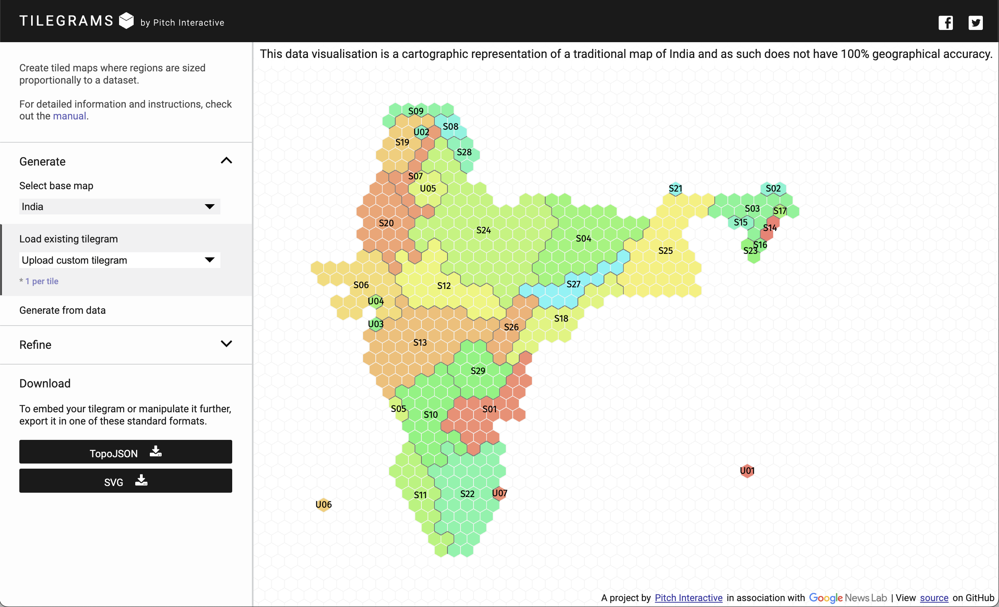




等面積タイル（Hex / Square）で人口や指標を表す「タイル地図（Tilegram）」を生成するツール

## 主な機能

1. **ベースマップ選択**：米国・欧州などのプリセットに加え、独自データをアップロードしてタイルを再配置できます。
2. **データインポート**：CSV/TSV から指標値を読み込み、タイル数や分割方法を自動調整します。
3. **手動調整**：ドラッグ＆ドロップでタイルの位置を微調整し、エリアごとのラベルを編集可能。
4. **エクスポート**：SVG と TopoJSON をダウンロードでき、D3.js など他の可視化ツールへ渡すことができます。

## 利用手順

1. `Start a new map` でテンプレートを選び、`Import Data` から指標値を読み込みます（列名は `id`, `name`, `value` が推奨）。
2. 自動配置されたタイルを `Manual edit` モードで調整し、地理的な位置関係や美観を最適化します。
3. `Export` から SVG / TopoJSON を取得し、Web ページや紙面へ展開します。

