Coloring administrative district maps — commonly known as blank maps — with data is called a "choropleth map." Although sometimes referred to as a "classified area map," <a href="https://visualizing.jp/classification-and-coloplethmap/" target="_blank">that term actually describes a data processing technique, not a visualization type</a>.

Using our "Japan Choropleth Map" and "Prefecture Choropleth Map" tools, you can easily create high-quality choropleth maps.

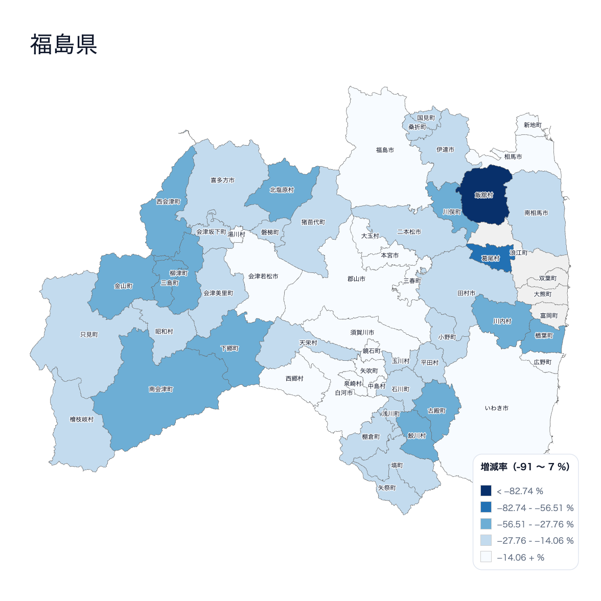

Here we introduce how to create one using our tools.




Paid subscribers can open the link above as an editable project file to learn the process and examine the data structure.


### Visualizing with Sample Data

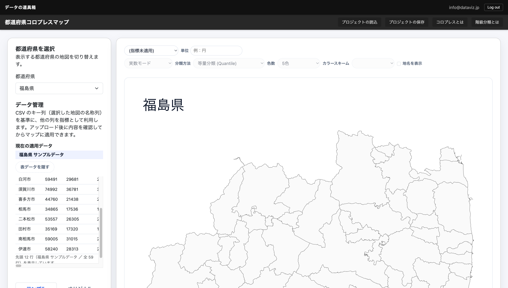

Here is what it looks like when you visualize pre-loaded population data on a Fukushima Prefecture map. By turning on the "Divide by area (/km²)" checkbox, the data becomes population density.

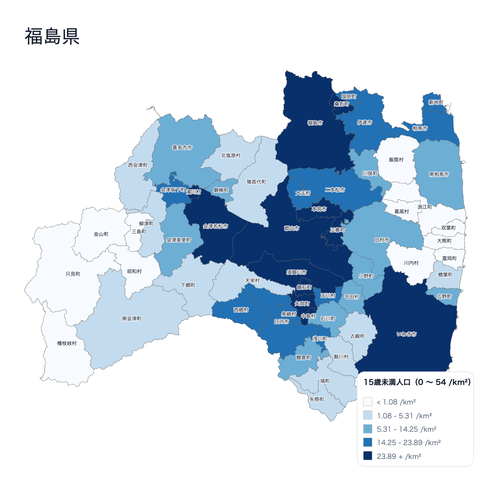

Incidentally, using a technique called a cartogram — which distorts area to reflect data (also available as a tool) — produces a warped map like this:

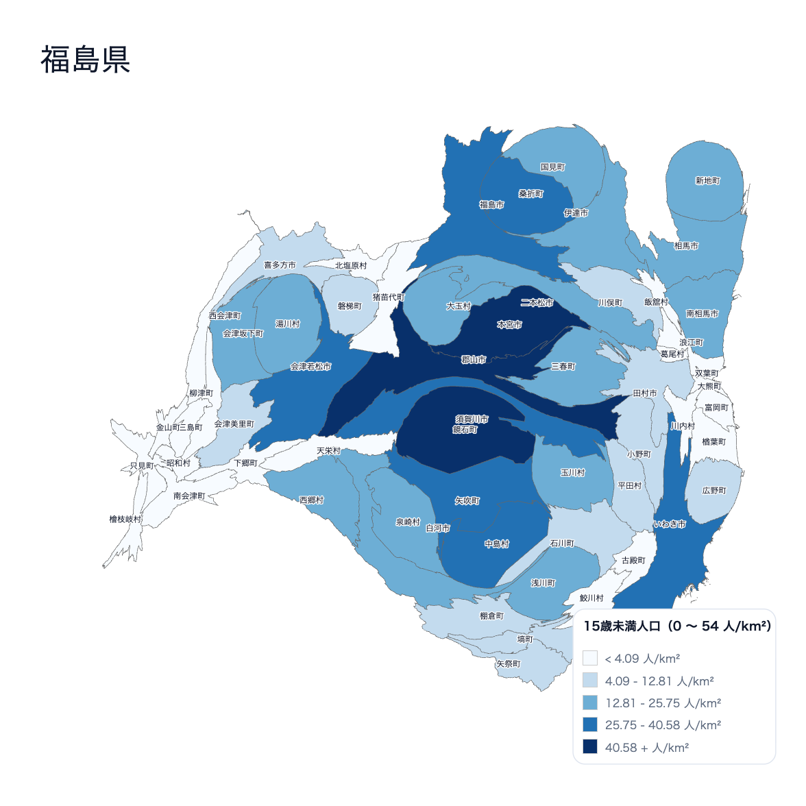


### Visualizing with Your Own Data

You can of course prepare and visualize your own data.

In that case, download the sample data and keep only the place names to see what geographic names you need to prepare data for.

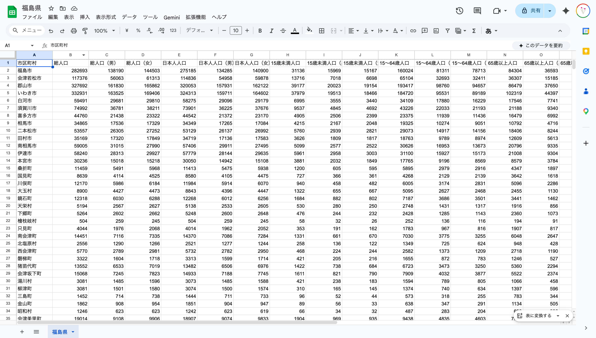

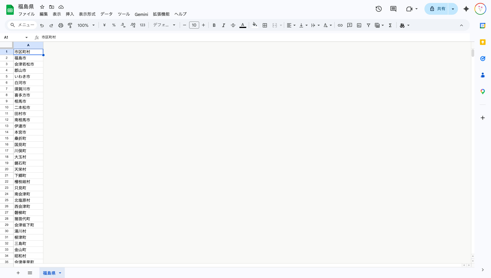

### Population Comparison Data Between 2011 and 2024

Download the "<a href="https://www.pref.fukushima.lg.jp/uploaded/attachment/702454.xlsx" target="_blank">Fukushima Prefecture Current Population Survey Annual Report: Reference Materials</a>" published by Fukushima Prefecture. This dataset compares population between 2011 and 2024.

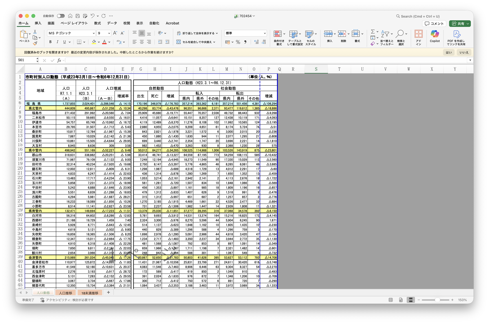

Keep only the sheet and table you need.

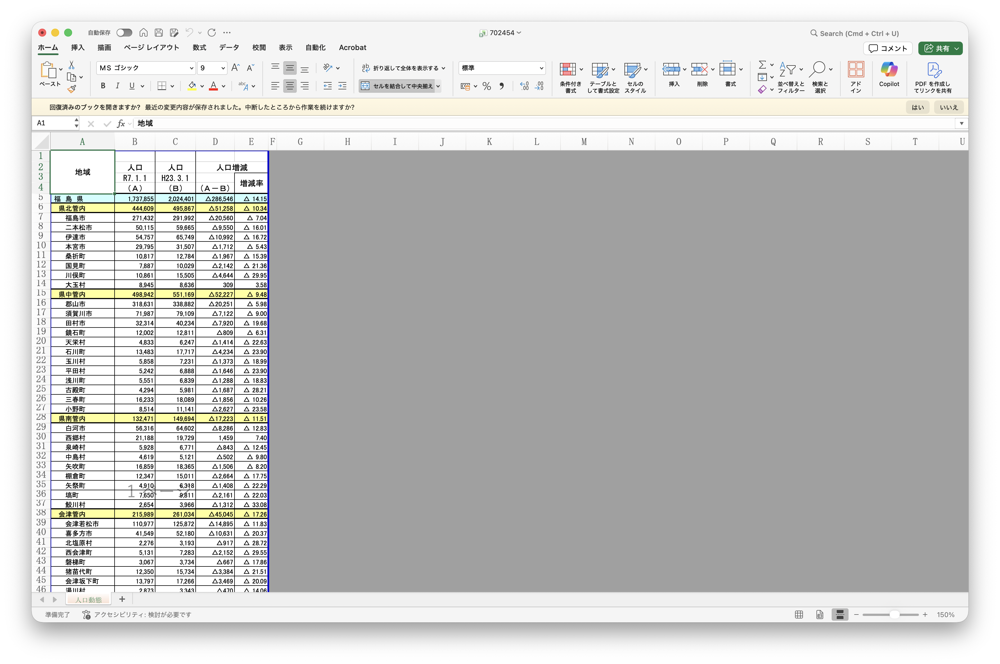

Once you have this, load it into OpenRefine for cleansing.

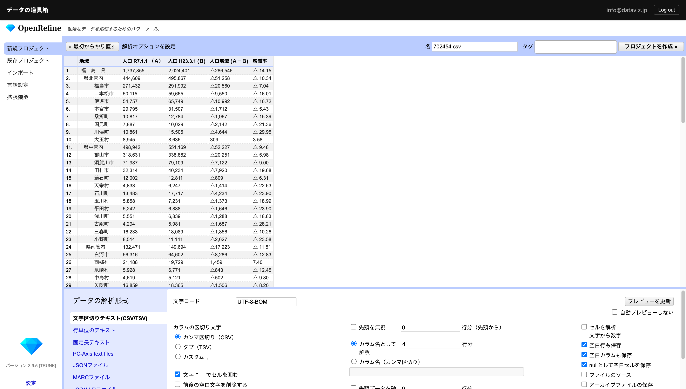

Remove unnecessary spaces and commas.
The minus sign is represented as "△", so replace it with the minus symbol "-".

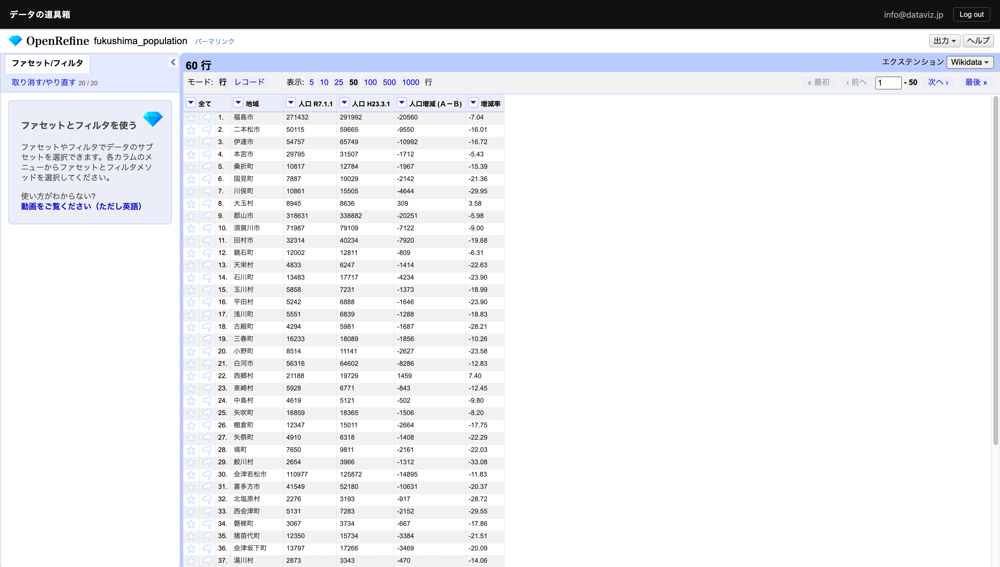

Also load the file with only municipality names from the sample data into OpenRefine as a separate project.

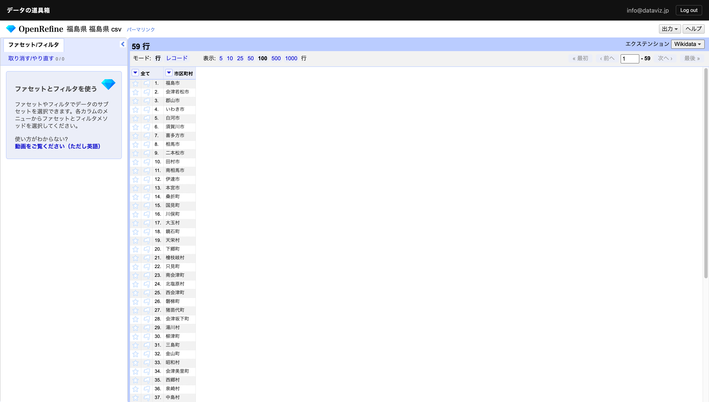

Use the "Add column based on this column" operation to perform a VLOOKUP-like join — merging two tables horizontally.

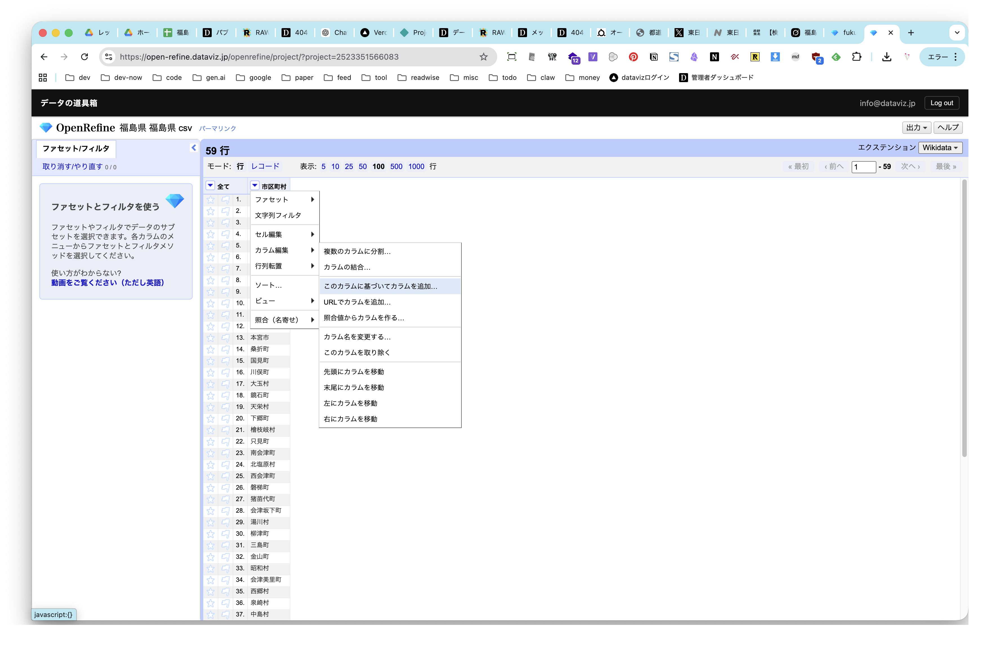

Join using an OpenRefine-specific script:

```
cell.cross('PROJECT_NAME','KEY_COLUMN_NAME').cells['COLUMN_NAME_TO_GET'].value[0]
```

- PROJECT_NAME — the project name of your original data
- KEY_COLUMN_NAME — the name of the column to use as the key
- COLUMN_NAME_TO_GET — the name of the column you want to join

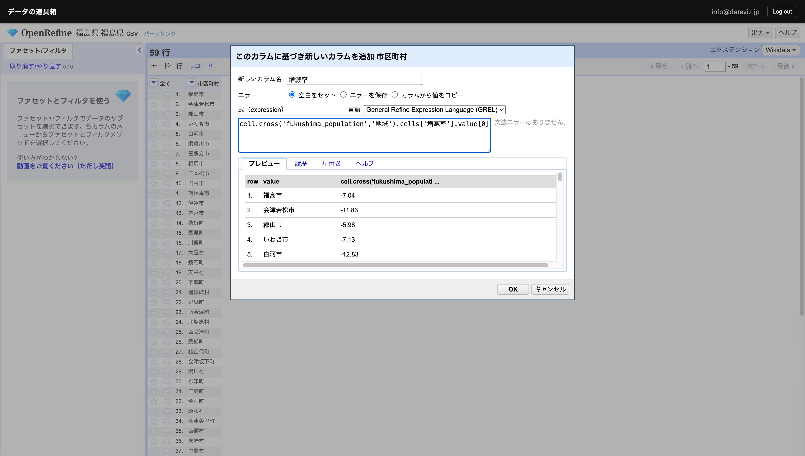

You can see that the join was successful for all municipalities except Futaba, Namie, Okuma, and Tomioka, where no data exists.

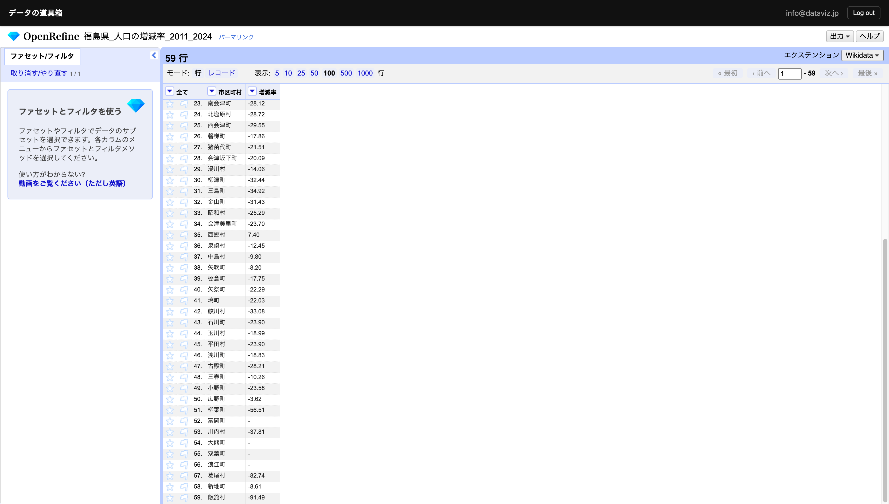

Municipalities with higher population change rates are displayed in darker colors.


