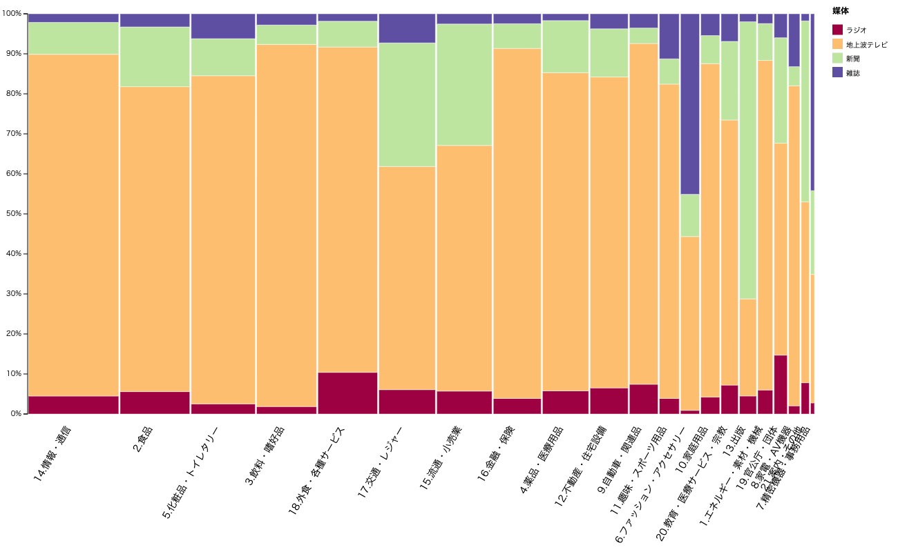
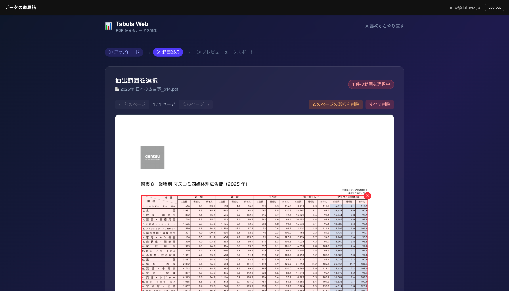
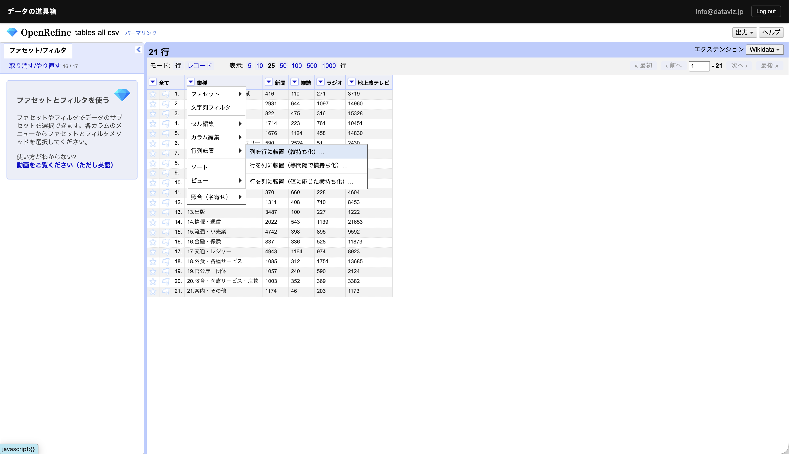
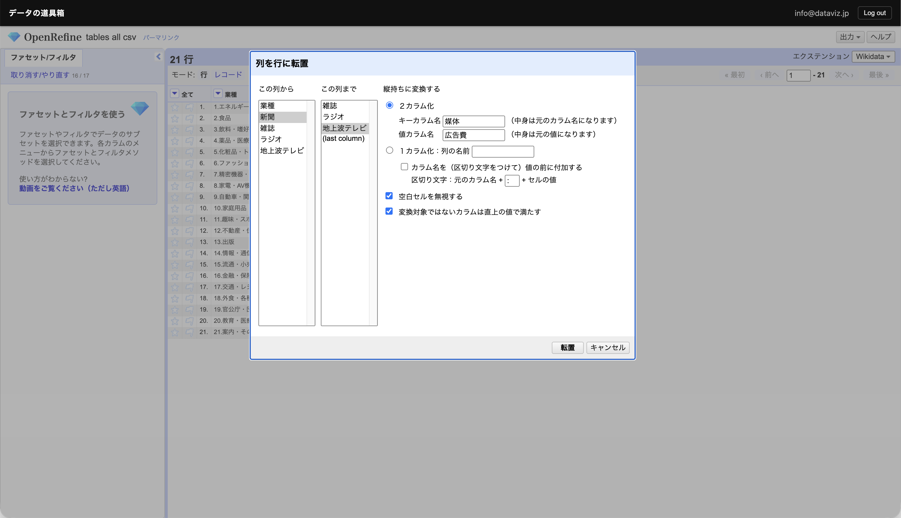
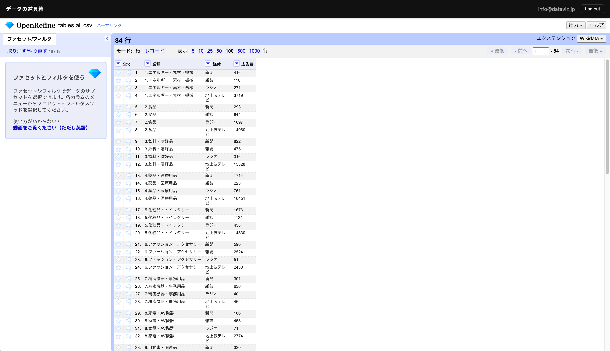
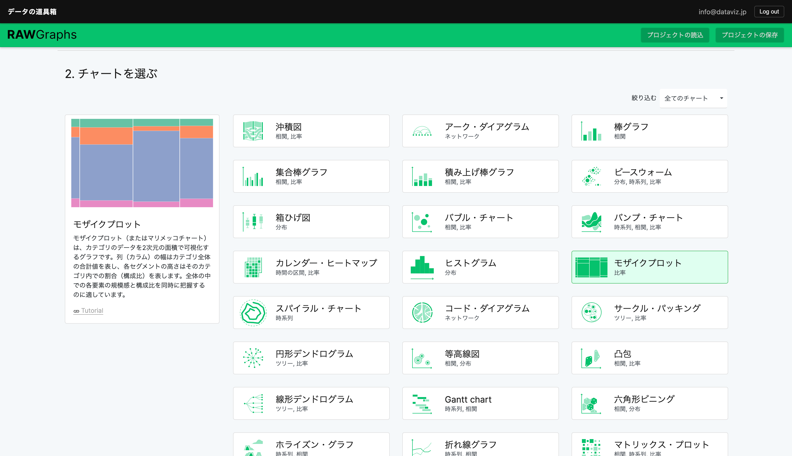
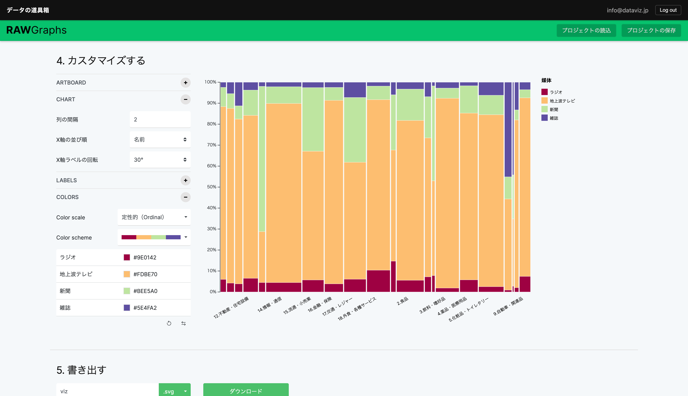
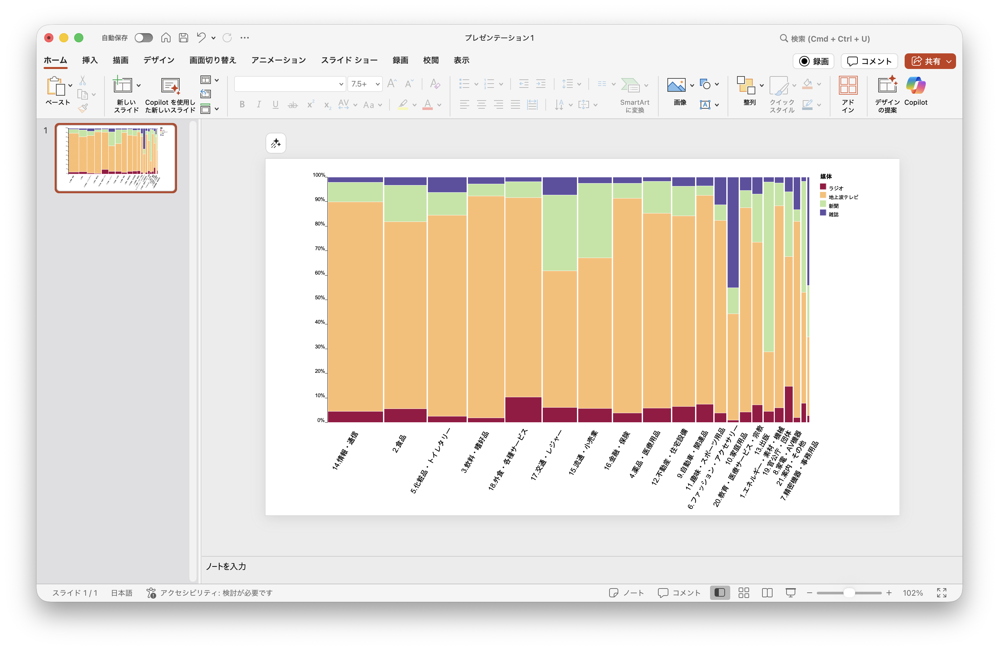

毎年電通さんが公表している「日本の広告費」。業種ごとのインターネットを覗く四媒体別広告費を可視化しました。

通常、棒グラフか円グラフを使うと、業種数（21つ）か媒体数（4つ）だけチャートを作成する必要がありますが、メッコ・チャートであれば、縦横の比率としてこれらを一つのチャートで表現することができます。

ここでは本サービスのツールを用いた作成の仕方を紹介します。




有料ユーザーであれば、上記リンクから編集可能なプロジェクト・ファイルとして開くことができ、作り方を学んだり、データのあり方を確認することができます。

データについては、電通さんのPDFを参照させていただいております。

- [2025年 日本の広告費 - News（ニュース） - 電通ウェブサイト](https://www.dentsu.co.jp/news/release/2026/0305-011003.html)

## PDFから表データを取り出す

公開資料がPDFで公開されています。このままではコンピュータで扱うことはできません。手作業でデータ化するのも面倒です。

こんなときは Tabula を使うと簡単に、PDFから表データを取り出すことができます。




## データをクレンジングする

コンピュータで扱える整頓データにするためには OpenRefine が便利です。ビジュアルに確認しながらデータをクレンジングできます。

不要な列を削除しました。そして不要な空白やコンマも削除しました。

そのままではクロス集計（マトリックス形式）された状態ですので、エクセルでいうピボットテーブルの逆を行います。OpenRefineならそれもビジュアルに行えます。

これでデータのクレンジングは終了です。
好きな可視化ツールを使いましょう。
今回はメッコ・チャートが簡単に作れる RawGraphs を用います。

## RawGraphsでデータ可視化する

RawGraphs は一画面で完結するツールで、工程を終えると、下へスクロールすることで、次の工程が現れます。

## 完成

PNGで出力すれば、スライドに掲載するなり、ウェブに掲載するなりできますね。

SVGで出力すれば、パワーポイントやAdobe Illustrator、Figmaなどのデザインツールで編集できます。
軸ラベルの一部が近すぎるので調整してみました。

### パワーポイントでの編集

### Adobe Illustratorでの編集

