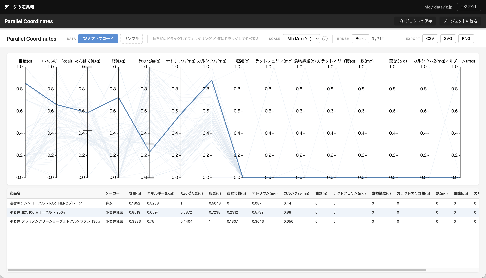
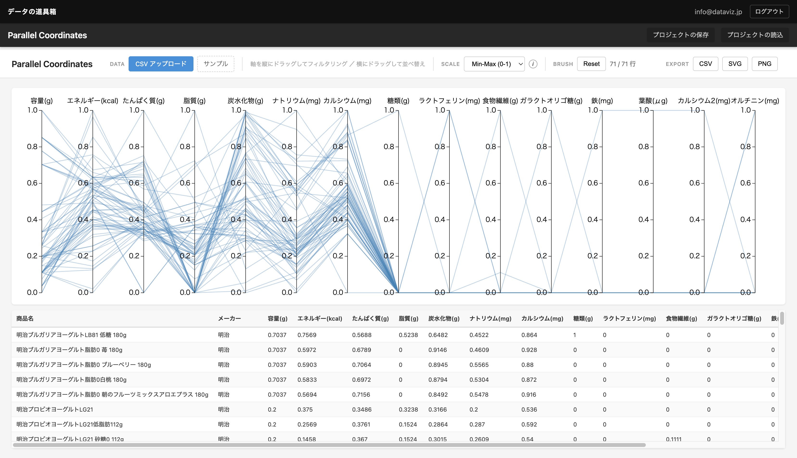

タンパク質が多め、糖分が少なめという「理想のヨーグルト」を探しましょう。

パラレル・コーディネイトチャートであれば、複数条件を同時に適用したデータのフィルタリングが手軽に行えます。

ここでは本サービスのツールを用いた作成の仕方を紹介します。




有料ユーザーであれば、上記リンクから編集可能なプロジェクト・ファイルとして開くことができ、作り方を学んだり、データのあり方を確認することができます。

## データの収集

まずはコンビニで販売しているヨーグルトの栄養成分を用意。各メーカーサイトに掲載されている栄養成分のデータを収集しました。

## パラレル・コーディネイトチャートでの可視化

70種類のヨーグルトの栄養データを読み込み、Min-Maxスケールに切り替えると、異なる単位の指標が同じ0-1の軸に揃います。

## 複数軸でのフィルタリング

たんぱく質の軸を上部でブラッシングし、炭水化物の軸を下部でブラッシングすると、「高タンパク・低糖質」の条件を満たす商品だけが青い線で残ります。

浮かび上がったのは濃密ギリシャヨーグルト PARTHENOプレーン――たんぱく質10.9gに対し炭水化物わずか4.6g。

## 軸の並び替えも可能

軸のドラッグで並べ替え、テーブルの行にホバーすれば該当ラインがハイライトされ、データの「手触り」が変わる体験をぜひ試してみてください。

