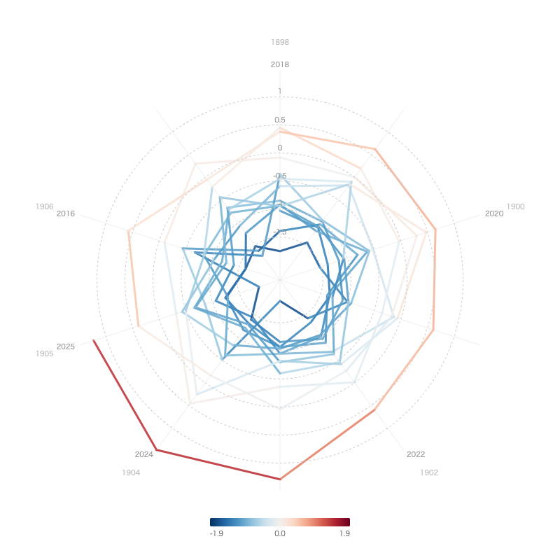

We visualized the annual mean temperature anomaly in Japan from 1898 to the present using a spiral chart.

With <a href="/rawgraphs/">RawGraphs</a>' spiral chart, you can arrange long-term time series data in a spiral layout, making it easy to grasp trends over time at a glance.

Here we introduce how to create this using our service's tools.




## Data Source

This visualization uses the "Annual Mean Temperature Anomaly in Japan" data published by the Japan Meteorological Agency (JMA).

- <a href="https://www.data.jma.go.jp/cpdinfo/temp/list/an_jpn.html" target="_blank">Annual Mean Temperature Anomaly in Japan — Japan Meteorological Agency</a>

This dataset records the temperature anomaly (°C) for each year from 1898 to 2025, calculated against the 30-year average from 1991 to 2020 as the baseline. In recent years, positive anomalies exceeding +1°C have continued, clearly showing a long-term warming trend.

## Visualization with RawGraphs

Load the CSV data into RawGraphs and select "Spiral Plot" from the chart types.

By assigning the year to the time axis and the temperature anomaly to the value, a spiral chart is drawn with the timeline progressing from the center outward. The closer to the outer edge, the more recent the data, and the warming trend becomes visually apparent through changes in color and position.

## Advantages of Spiral Charts

While bar charts or line charts can represent the same data, they become too wide for long-term data spanning over 100 years. Spiral charts can fit long time series into a compact area, making it easier to get an overview of the overall trend.

By comparing the inner part of the spiral (past) with the outer part (present), you can intuitively grasp how the temperature anomaly has been growing larger year by year.
